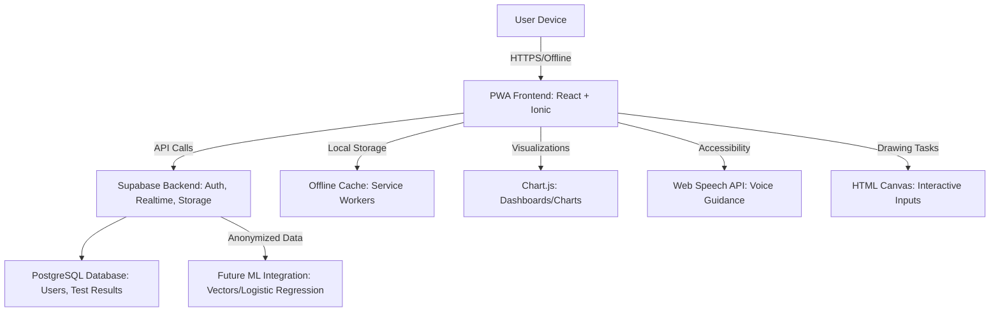

# NeuralHack Cognitive AI Prototype

## Problem
In 2025, over 55 million people live with dementia globally, with 10 million new cases annually (WHO, 2023). In Mexico, 1.3 million suffer from dementia, more than half undiagnosed due to limited access to specialized healthcare (INEGI, 2022). There are no accessible, fast, and affordable methods for early screening in rural or marginalized communities.

## Solution
NeuralHack Cognitive AI is a mobile-first Progressive Web App (PWA) that provides early screening for neurodegenerative diseases (Alzheimer's, Parkinson's, dementia) and depression in under 10 minutes using validated tests. It employs a rule-based model for risk prediction, a dashboard with insights, and longitudinal tracking. Prioritizes accessibility for adults aged 40-60, Spanish language, security, and ethics. Developed with zero CAPEX using Supabase and open-source tools.

## How It Works
Users register, complete interactive tests (MoCA, PHQ-9, MMSE, AD8, Parkinson's questionnaire). The app automatically scores, maps risks (0-100%), generates charts/insights, and recommends actions. Data is securely stored in Supabase with Row Level Security (RLS). The data portal allows comparing tests to monitor progression.

## Competitive Differentiator
Non-invasive screening, offline-capable, culturally adapted to Mexico. Supabase integration for auth/DB in real-time. **Regulatory-compliant SaMD (Software as Medical Device) with clear pathways for FDA, COFEPRIS, and CE approval**. Complies with privacy regulations (GDPR/HIPAA/LFPDPPP). Open-source for clinical validation with universities.

## Regulatory Classification & Compliance

### **Software as Medical Device (SaMD) - Class II**
- **FDA (US)**: Class II medical device requiring 510(k) or De Novo pathway
- **COFEPRIS (Mexico)**: Class II under NOM-241-SSA1-2021 framework
- **CE Marking (Europe)**: Class IIa under MDR 2017/745 Regulation

### **Regulatory Pathways**
- **FDA Route**: 510(k) premarket notification or Breakthrough Device Program
- **COFEPRIS Route**: Registro Sanitario via DIGIPRiS platform
- **CE Route**: Notified Body assessment with Clinical Evaluation Report (CER)

### **Clinical Validation Requirements**
- **Clinical Association**: Validated correlation between digital biomarkers and cognitive state
- **Analytical Validation**: Technical performance of algorithms and software
- **Clinical Validation**: Real-world effectiveness in target population
- **Post-Market Surveillance**: Continuous monitoring (PMS/PMCF/Tecnovigilancia)

### **Privacy & Security Compliance**
- **GDPR (Europe)**: Full compliance with data protection regulation
- **HIPAA (US)**: Healthcare data security and privacy standards
- **LFPDPPP (Mexico)**: Mexican personal data protection law compliance
- **Encryption**: AES-256 for PII data, application-level encryption

## Niche and Buyer Personas
Adults aged 40-60 concerned about cognitive health. Caregivers/family members. Rural clinics in Mexico/LATAM.

## Market Size (TAM)
Telehealth: USD 286.22 billion in 2025 (CAGR 15.5%) (Towards Healthcare). Dementia apps: 4.8% annual growth (Cognitive Market Research). Digital health in LATAM: USD 25.1 billion in 2024 (CAGR 5.5%) (Mexico Business News).

## Scalability
PWA deployable via GitHub Pages/Supabase. Future ML (logistic regression) with Supabase Vectors. Partnerships with UNAM/IPN for validation.

## Profitability
Freemium: Basic free; premium for clinics ($). Anonymized data for R&D. Low CAPEX: Supabase free tier.

## Prototype TRL1
PWA with basic tests, hosted on GitHub Pages + Supabase backend.

## Lean Startup Canvas
Problem: Late diagnosis. Solution: AI screening app. Metrics: Tests completed, referral rate. Unique Value: Accessible/offline. Channels: App stores, social media. Revenues: Subscriptions. Costs: Development. Partners: Universities. Segments: 40-60 years, clinics.

## Features
- **Registration/Sign-in**: Auth with email/OAuth via Supabase, ethical consent.
- **Cognitive Tests**: MoCA, PHQ-9, MMSE, AD8, Parkinson's Questionnaire – interactive, in Spanish, with timers/drawing/voice.
- **Scoring and Prediction**: Rule-based for risk (low/moderate/high), adjusted by demographics (age/education).
- **Dashboard/UI**: Charts (bars, lines, pies) with insights, longitudinal trends, progression alerts.
- **Recommendations**: Personalized (lifestyle, specialist consultation).
- **Educational Content**: Preventive articles, links (WHO, Alzheimer’s Association).
- **Longitudinal Tracking**: Data portal for test comparisons, progression charts.
- **Accessibility**: Large fonts, high contrast, voice guidance (Web Speech API), simple navigation for 40-60 years.
- **Language**: Spanish primary (Mexican dialect), English secondary via i18next.
- **Security/Ethics**: Supabase RLS, encryption, consent, anonymization, compliance with GDPR/HIPAA/LFTIDPI.
- **Offline**: Service workers for PWA.
- **Data Portal**: Historical test view, illness progression comparisons.

## Tech Stack

### **Frontend (Regulatory-Compliant PWA)**
- **Framework**: React + Ionic (PWA, mobile UI, offline support)
- **Language**: TypeScript (strict mode for medical device quality)
- **State Management**: Zustand (lightweight, predictable state)
- **Charts**: Chart.js (data visualization)
- **Voice**: Web Speech API (Spanish support for linguistic analysis)
- **Drawing**: HTML Canvas + React hooks (for cognitive drawing tasks)
- **Accessibility**: WCAG 2.1 AA compliance for elderly users

### **Backend (Healthcare-Grade Supabase)**
- **Database**: PostgreSQL with Row Level Security (RLS)
- **Authentication**: Supabase Auth (JWT/OAuth with medical consent tracking)
- **Storage**: Supabase Storage (encrypted file storage)
- **Real-time**: Supabase Realtime (live updates)
- **Edge Functions**: Advanced scoring algorithms and AI processing

### **Compliance & Security**
- **Quality Management**: ISO 13485 compliant development process
- **Security**: Supabase RLS, JWT/OAuth, AES-256 encryption
- **Audit Logging**: Immutable audit trails for HIPAA/GDPR compliance
- **Interoperability**: HL7 FHIR (US), NOM-024-SSA3-2012 (Mexico)
- **CI/CD**: GitHub Actions with security scanning and compliance checks

### **Hosting & Deployment**
- **Frontend**: GitHub Pages/Vercel (CDN-optimized)
- **Backend**: Supabase cloud (healthcare-grade infrastructure)
- **Monitoring**: Application performance and security monitoring
- **Backup**: Automated encrypted backups with retention policies

## App Architecture Diagram

## Strategic Market Decision Required

### **Regulatory Pathway Options**
Based on comprehensive regulatory analysis, the team must choose the optimal market entry strategy:

#### **Option A: Mexico First (COFEPRIS)**
- ✅ **Advantages**: NOM-241-SSA1-2021 aligned with IMDRF, modern DIGIPRiS platform
- ✅ **Target alignment**: Direct match with Mexican population focus
- ⚠️ **Challenge**: Requires Mexico-specific clinical validation

#### **Option B: FDA First (United States)**
- ✅ **Advantages**: Breakthrough Device Program available, mature digital health ecosystem
- ✅ **Evidence acceptance**: Real World Evidence and digital biomarkers accepted
- ⚠️ **Challenge**: More competitive market, complex regulatory requirements

#### **Option C: CE Marking First (Europe)**
- ✅ **Advantages**: Access to 27 countries, international standards
- ❌ **Disadvantages**: Stricter MDR requirements, Rule 11 increases risk classification

### **Next Steps**
1. **Strategic Decision**: Select primary regulatory pathway within 2 weeks
2. **Clinical Validation**: Design studies specific to chosen jurisdiction
3. **Quality Management**: Implement ISO 13485 compliant development process
4. **Cultural Adaptation**: Prioritize research for target population

---

**Last Updated**: August 2025 | **Regulatory Analysis**: Complete | **Decision Required**: Market Selection 
