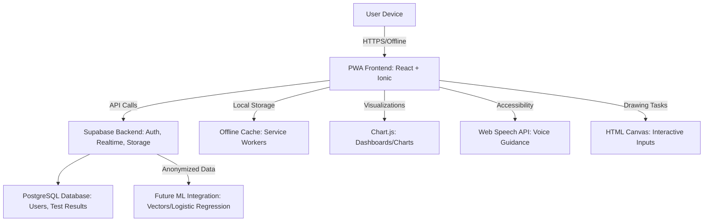
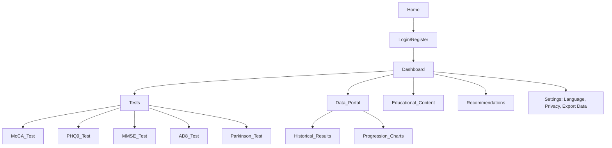

# NeuralHack Cognitive AI Prototype

## Problem
In 2025, over 55 million people live with dementia globally, with 10 million new cases annually (WHO, 2023). In Mexico, 1.3 million suffer from dementia, more than half undiagnosed due to limited access to specialized healthcare (INEGI, 2022). There are no accessible, fast, and affordable methods for early screening in rural or marginalized communities.

## Solution
NeuralHack Cognitive AI is a mobile-first Progressive Web App (PWA) that provides early screening for neurodegenerative diseases (Alzheimer's, Parkinson's, dementia) and depression in under 10 minutes using validated tests. It employs a rule-based model for risk prediction, a dashboard with insights, and longitudinal tracking. Prioritizes accessibility for adults aged 40-60, Spanish language, security, and ethics. Developed with zero CAPEX using Supabase and open-source tools.

## How It Works
Users register, complete interactive tests (MoCA, PHQ-9, MMSE, AD8, Parkinson's questionnaire). The app automatically scores, maps risks (0-100%), generates charts/insights, and recommends actions. Data is securely stored in Supabase with Row Level Security (RLS). The data portal allows comparing tests to monitor progression.

## Competitive Differentiator
Non-invasive screening, offline-capable, culturally adapted to Mexico. Supabase integration for auth/DB in real-time. Complies with SaMD (COFEPRIS) and privacy (GDPR/HIPAA/LFTIDPI). Open-source for clinical validation with universities.

## Niche and Buyer Personas
Adults aged 40-60 concerned about cognitive health. Caregivers/family members. Rural clinics in Mexico/LATAM.

## Market Size (TAM)
Telehealth: USD 286.22 billion in 2025 (CAGR 15.5%) (Towards Healthcare). Dementia apps: 4.8% annual growth (Cognitive Market Research). Digital health in LATAM: USD 25.1 billion in 2024 (CAGR 5.5%) (Mexico Business News).

## Scalability
PWA deployable via GitHub Pages/Supabase. Future ML (logistic regression) with Supabase Vectors. Partnerships with UNAM/IPN for validation.

## Profitability
Freemium: Basic free; premium for clinics ($). Anonymized data for R&D. Low CAPEX: Supabase free tier.

## Prototype TRL1
PWA with basic tests, hosted on GitHub Pages + Supabase backend.

## Lean Startup Canvas
Problem: Late diagnosis. Solution: AI screening app. Metrics: Tests completed, referral rate. Unique Value: Accessible/offline. Channels: App stores, social media. Revenues: Subscriptions. Costs: Development. Partners: Universities. Segments: 40-60 years, clinics.

## Features
- **Registration/Sign-in**: Auth with email/OAuth via Supabase, ethical consent.
- **Cognitive Tests**: MoCA, PHQ-9, MMSE, AD8, Parkinson's Questionnaire – interactive, in Spanish, with timers/drawing/voice.
- **Scoring and Prediction**: Rule-based for risk (low/moderate/high), adjusted by demographics (age/education).
- **Dashboard/UI**: Charts (bars, lines, pies) with insights, longitudinal trends, progression alerts.
- **Recommendations**: Personalized (lifestyle, specialist consultation).
- **Educational Content**: Preventive articles, links (WHO, Alzheimer’s Association).
- **Longitudinal Tracking**: Data portal for test comparisons, progression charts.
- **Accessibility**: Large fonts, high contrast, voice guidance (Web Speech API), simple navigation for 40-60 years.
- **Language**: Spanish primary (Mexican dialect), English secondary via i18next.
- **Security/Ethics**: Supabase RLS, encryption, consent, anonymization, compliance with GDPR/HIPAA/LFTIDPI.
- **Offline**: Service workers for PWA.
- **Data Portal**: Historical test view, illness progression comparisons.

## Tech Stack
- **Frontend**: React + Ionic (PWA, mobile UI, offline support).
- **Backend/DB**: Supabase (Auth, PostgreSQL, Storage, Realtime features).
- **i18n**: i18next (Spanish/English localization).
- **Charts**: Chart.js (data visualization).
- **Voice**: Web Speech API (Spanish support).
- **Drawing**: HTML Canvas + React hooks (for drawing tasks).
- **Hosting**: Frontend on GitHub Pages/Vercel; Backend on Supabase free tier.
- **CI/CD**: GitHub Actions (automated testing and deployment).
- **Security**: Supabase RLS, JWT/OAuth, AES-256 encryption.

## App Architecture Diagram


## Sitemap Diagram



## App Structure for Pages and Data

```erDiagram
    USERS ||--o{ TEST_RESULTS : "has many"
    USERS {
        uuid id PK
        string email
        timestamp created_at
        boolean consent_given
    }
    TEST_RESULTS {
        uuid id PK
        uuid user_id FK
        string test_type "e.g., 'moca', 'phq9'"
        integer score
        string risk_level "e.g., 'low', 'moderate', 'high'"
        timestamp timestamp
        jsonb raw_answers "Raw question responses"
        jsonb demographics "e.g., age, education"
    }
    PAGES {
        string page_name "e.g., 'Dashboard', 'MoCA_Test'"
        string route "e.g., '/dashboard', '/tests/moca'"
    }
    USERS ||--o{ PAGES : "navigates to"
```

## Setup Instructions for MVP

```markdown
## Setup Instructions
1. **Clone Repo**: `git clone https://github.com/your-repo/neuralhack.git && cd neuralhack`
2. **Install Dependencies**: `npm install`
   - Add: `npm i @supabase/supabase-js react-i18next i18next chart.js @ionic/react @ionic/react-router html2canvas` (for drawing export).
3. **Create Supabase Project**: Go to supabase.com, create a free project. Copy URL/API key.
4. **Configure Env**: Create `.env` with:
   ```
   REACT_APP_SUPABASE_URL=your-url
   REACT_APP_SUPABASE_ANON_KEY=your-key
   ```
5. **Initialize Supabase**: In `src/supabaseClient.js`:
   ```js
   import { createClient } from '@supabase/supabase-js';
   const supabaseUrl = process.env.REACT_APP_SUPABASE_URL;
   const supabaseAnonKey = process.env.REACT_APP_SUPABASE_ANON_KEY;
   export const supabase = createClient(supabaseUrl, supabaseAnonKey);
   ```
6. **Configure DB in Supabase**: In Supabase dashboard, create tables:
   - `users`: id (uuid), email, created_at, consent_given (boolean).
   - `test_results`: id (uuid), user_id (uuid), test_type (text: 'moca' etc.), score (int), risk_level (text), timestamp (timestamptz), raw_answers (jsonb), demographics (jsonb).
   - Enable RLS: Policies for read/write only by authenticated users, row owner = user_id.
7. **Start App**: `npm start`

## Development Guide

### Frontend (React + Ionic)
Use Ionic for mobile UI. Structure: App.tsx with router, pages for login, tests, dashboard.

- **Sign-in/Auth**: Use Supabase auth.
  ```js
  // src/pages/Login.tsx
  import { supabase } from '../supabaseClient';
  const signUp = async (email, password) => {
    const { data, error } = await supabase.auth.signUp({ email, password });
    if (error) console.error(error);
  };
  const signIn = async (email, password) => {
    const { data, error } = await supabase.auth.signInWithPassword({ email, password });
    if (error) console.error(error);
  };
  // Consent: Display modal with privacy policy, store consent in DB.
  ```
- **Accessibility/UI/UX**: Fonts >16pt, WCAG contrast, tab navigation (home/tests/dashboard). Use Ionic <IonPage>, <IonContent>. For 40-60: Large icons, voice instructions.
- **Language**: Configure i18next.
  ```js
  // src/i18n.js
  import i18n from 'i18next';
  import { initReactI18next } from 'react-i18next';
  i18n.use(initReactI18next).init({
    resources: {
      es: { translation: { /* translations */ } },
      en: { translation: { /* translations */ } }
    },
    lng: 'es', fallbackLng: 'es'
  });
  // Usage: const { t } = useTranslation(); <p>{t('key')}</p>
  ```
- **Voice Guidance**: Web Speech API.
  ```js
  const speak = (text, lang = 'es-MX') => {
    const utterance = new SpeechSynthesisUtterance(text);
    utterance.lang = lang;
    window.speechSynthesis.speak(utterance);
  };
  // In tests: speak('Instruction in Spanish');
  ```

### Implementing Tests
Each test on a separate page, with React forms, timers, canvas for drawing. Store raw responses in Supabase JSONB for auditing.

- **MoCA (Spanish)**:
  Structure: Culturally adapted (animals: lion, rhinoceros, camel → jaguar, elephant, camel if needed).
  Questions (Spanish, based on standard versions):
  - Visuospatial: Draw cube/clock (use <canvas> for drawing, html2canvas for save).
    Code:
    ```js
    // Canvas Drawing
    const canvasRef = useRef(null);
    useEffect(() => {
      const canvas = canvasRef.current;
      const ctx = canvas.getContext('2d');
      // Event listeners for touch/mouse draw
    }, []);
    ```
  - Naming: Identify jaguar, elephant, camel (multiple choice).
  - Memory: Recall 5 words (face, velvet, church, daisy, red) – 5min delayed recall timer.
    Code: setTimeout(() => { /* recall */ }, 300000);
  - Etc. (implement forms <IonInput>, <IonSelect>).
  Scoring: Sum sections, adjust +1 if education ≤12.
  Save: await supabase.from('test_results').insert({ user_id, test_type: 'moca', score, raw_answers: json });

- **PHQ-9 (Spanish)**:
  Questions (Spanish):
  - Little interest or pleasure in doing things.
  - Feeling down, depressed, or hopeless.
  - Trouble falling or staying asleep, or sleeping too much.
  - Feeling tired or having little energy.
  - Poor appetite or overeating.
  - Feeling bad about yourself or that you are a failure.
  - Trouble concentrating on things.
  - Moving or speaking so slowly that others notice, or fidgety.
  - Thoughts that you would be better off dead or hurting yourself.
  Likert 0-3.
  Code: <IonRadioGroup> for each.
  Scoring: Sum, flag Q9 if >0 for alert.

- **MMSE (Spanish)**:
  Questions (Spanish, adjusted):
  - Orientation: Year, season, date, day, month; state, county, town, hospital, floor.
  - Registration: Repeat apple, table, penny.
  - Attention: Subtract 7 from 100 (5 times) or spell "WORLD" backward.
  - Recall: Recall objects.
  - Language: Name objects, repeat phrase, 3-stage command, read/write, draw pentagons (canvas).
  Scoring: 0-30, adjust for age/education.

- **AD8 (Spanish)**:
  Items (Spanish):
  - Problems with judgment (e.g., poor financial decisions).
  - Reduced interest in hobbies/activities.
  - Repeats questions/stories.
  - Trouble remembering the month/year.
  - Difficulty handling finances.
  - Trouble remembering appointments.
  - Daily problems with thinking/remembering.
  - Trouble operating gadgets.
  Yes/No (0/1).

- **Parkinson's Questionnaire (Spanish)**:
  Questions (based on MJFF, translated):
  - Have you become slower in daily activities?
  - Do you have tremors or shaking?
  - Do you feel stiff?
  - Changes in balance/walking?
  - Changes in handwriting/speech?
  Yes/No, sum yes.

### Rule-Based Model for Prediction
In JS functions:
```js
const calculateMoCARisk = (score, education) => {
  if (education <= 12) score += 1;
  if (score >= 26) return { level: 'low', prob: '0-5%' };
  if (score >= 20) return { level: 'moderate', prob: '5-40%' };
  return { level: 'high', prob: '>40%' };
};
// Similar for others.
```

### Dashboard and Insights
Use Chart.js for lines (trends), bars (risks), pies (categories).
Code:
```js
import { Line } from 'react-chartjs-2';
<Line data={{ labels: timestamps, datasets: [{ data: scores }] }} />
```
Insights: "Your MoCA risk decreased 10% since last test – good progress!"

### Backend and Data Management (Supabase)
- Auth: Sign-in required for tests/portal.
- Storage: Raw data in jsonb, anonymized for future ML (remove PII).
- Realtime: Subscriptions for dashboard updates.
  Code:
  ```js
  supabase.from('test_results').select('*').eq('user_id', user.id).then(data => { /* process */ });
  ```
- Security: RLS (policies: insert/read own rows), consent modal stores in DB, export/delete data.
- Ethics: Initial modal: "Consent for health data – not diagnosis, only screening. Complies with LFTIDPI."

### Deployment and Maintenance
- Frontend: `npm run build`, deploy to GitHub Pages.
- Supabase: Auto-scales free tier.
- CI/CD: GitHub Actions for tests/deploy.
- Updates: Monitor feedback, monthly fixes.

## Validation
Pilot: 20-50 users aged 40-60. Measure sensitivity/specificity vs clinical diagnoses. Partners: UNAM/IPN.

## References
- Supabase Docs (2025).
- WHO Dementia (2023).
- Tests: Nasreddine et al. (2005) MoCA; Kroenke et al. (2001) PHQ-9; etc.

Ready to implement – fork and contribute!

