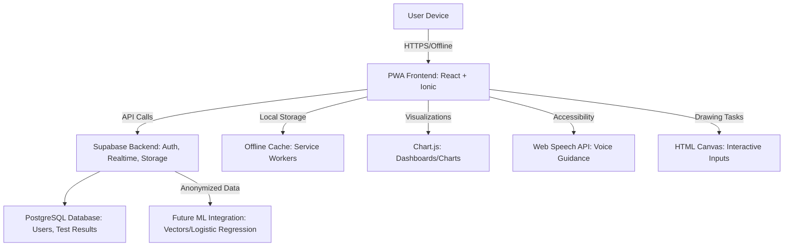
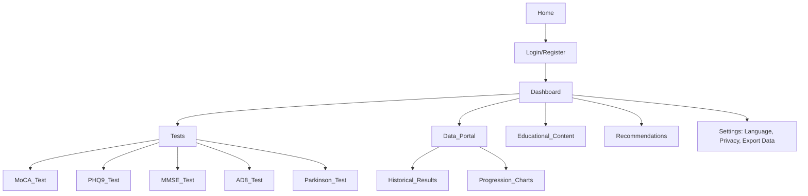

# NeuralHack Cognitive AI Prototype

## Problem
In 2025, over 55 million people live with dementia globally, with 10 million new cases annually (WHO, 2023). In Mexico, 1.3 million suffer from dementia, more than half undiagnosed due to limited access to specialized healthcare (INEGI, 2022). There are no accessible, fast, and affordable methods for early screening in rural or marginalized communities.

## Solution
NeuralHack Cognitive AI is a mobile-first Progressive Web App (PWA) that provides early screening for neurodegenerative diseases (Alzheimer's, Parkinson's, dementia) and depression in under 10 minutes using validated tests. It employs a rule-based model for risk prediction, a dashboard with insights, and longitudinal tracking. Prioritizes accessibility for adults aged 40-60, Spanish language, security, and ethics. Developed with zero CAPEX using Supabase and open-source tools.

## How It Works
Users register, complete interactive tests (MoCA, PHQ-9, MMSE, AD8, Parkinson's questionnaire). The app automatically scores, maps risks (0-100%), generates charts/insights, and recommends actions. Data is securely stored in Supabase with Row Level Security (RLS). The data portal allows comparing tests to monitor progression.

## Competitive Differentiator
Non-invasive screening, offline-capable, culturally adapted to Mexico. Supabase integration for auth/DB in real-time. Complies with SaMD (COFEPRIS) and privacy (GDPR/HIPAA/LFTIDPI). Open-source for clinical validation with universities.

## Niche and Buyer Personas
Adults aged 40-60 concerned about cognitive health. Caregivers/family members. Rural clinics in Mexico/LATAM.

## Market Size (TAM)
Telehealth: USD 286.22 billion in 2025 (CAGR 15.5%) (Towards Healthcare). Dementia apps: 4.8% annual growth (Cognitive Market Research). Digital health in LATAM: USD 25.1 billion in 2024 (CAGR 5.5%) (Mexico Business News).

## Scalability
PWA deployable via GitHub Pages/Supabase. Future ML (logistic regression) with Supabase Vectors. Partnerships with UNAM/IPN for validation.

## Profitability
Freemium: Basic free; premium for clinics ($). Anonymized data for R&D. Low CAPEX: Supabase free tier.

## Prototype TRL1
PWA with basic tests, hosted on GitHub Pages + Supabase backend.

## Lean Startup Canvas
Problem: Late diagnosis. Solution: AI screening app. Metrics: Tests completed, referral rate. Unique Value: Accessible/offline. Channels: App stores, social media. Revenues: Subscriptions. Costs: Development. Partners: Universities. Segments: 40-60 years, clinics.

## Features
- **Registration/Sign-in**: Auth with email/OAuth via Supabase, ethical consent.
- **Cognitive Tests**: MoCA, PHQ-9, MMSE, AD8, Parkinson's Questionnaire – interactive, in Spanish, with timers/drawing/voice.
- **Scoring and Prediction**: Rule-based for risk (low/moderate/high), adjusted by demographics (age/education).
- **Dashboard/UI**: Charts (bars, lines, pies) with insights, longitudinal trends, progression alerts.
- **Recommendations**: Personalized (lifestyle, specialist consultation).
- **Educational Content**: Preventive articles, links (WHO, Alzheimer’s Association).
- **Longitudinal Tracking**: Data portal for test comparisons, progression charts.
- **Accessibility**: Large fonts, high contrast, voice guidance (Web Speech API), simple navigation for 40-60 years.
- **Language**: Spanish primary (Mexican dialect), English secondary via i18next.
- **Security/Ethics**: Supabase RLS, encryption, consent, anonymization, compliance with GDPR/HIPAA/LFTIDPI.
- **Offline**: Service workers for PWA.
- **Data Portal**: Historical test view, illness progression comparisons.

## Tech Stack
- **Frontend**: React + Ionic (PWA, mobile UI, offline support).
- **Backend/DB**: Supabase (Auth, PostgreSQL, Storage, Realtime features).
- **i18n**: i18next (Spanish/English localization).
- **Charts**: Chart.js (data visualization).
- **Voice**: Web Speech API (Spanish support).
- **Drawing**: HTML Canvas + React hooks (for drawing tasks).
- **Hosting**: Frontend on GitHub Pages/Vercel; Backend on Supabase free tier.
- **CI/CD**: GitHub Actions (automated testing and deployment).
- **Security**: Supabase RLS, JWT/OAuth, AES-256 encryption.

## App Architecture Diagram

## Sitemap Diagram

