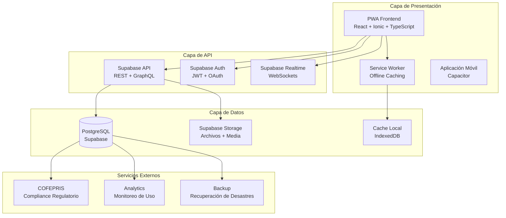
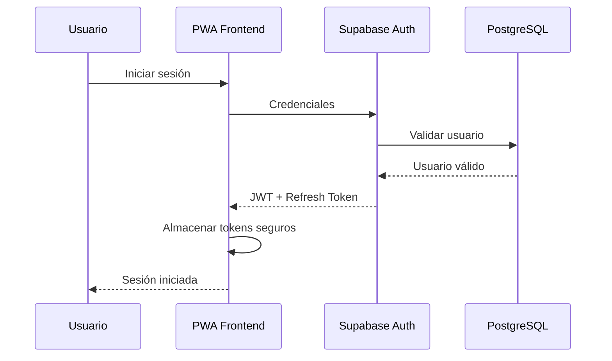
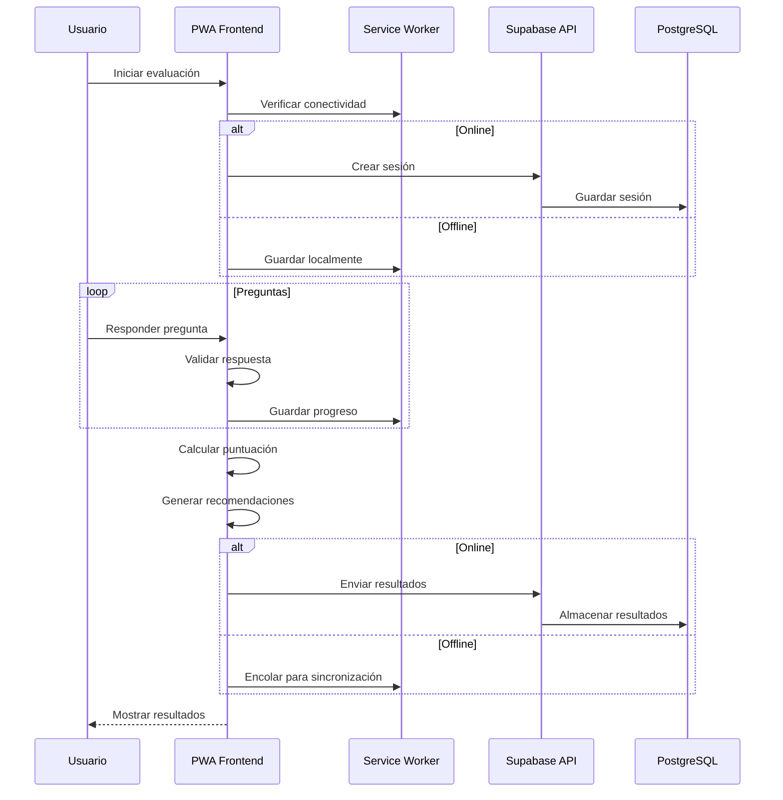
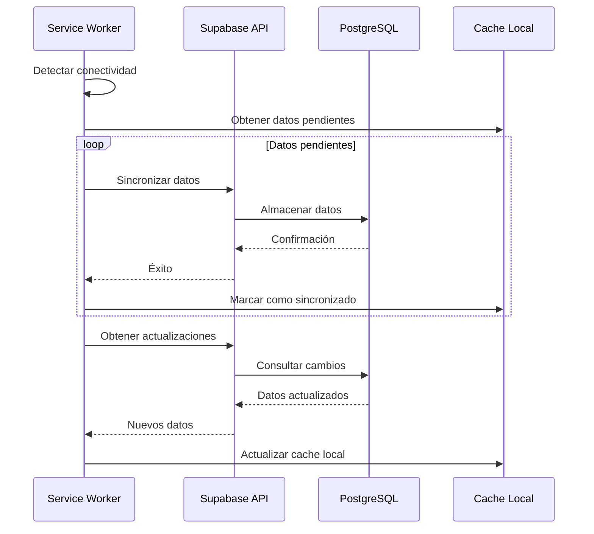

# Arquitectura del Sistema - NeuralHack Cognitive AI

## Resumen Ejecutivo

NeuralHack Cognitive AI es una Progressive Web App (PWA) diseñada como Software as Medical Device (SaMD) para el tamizaje temprano de enfermedades neurodegenerativas. La arquitectura sigue principios de seguridad por diseño, escalabilidad y cumplimiento regulatorio.

## Arquitectura de Alto Nivel



## Componentes Principales

### 1. Frontend (Capa de Presentación)

#### Progressive Web App (PWA)
- **Tecnología**: React 18+ con TypeScript
- **Framework UI**: Ionic React para componentes móviles nativos
- **Estado**: Zustand para manejo de estado ligero
- **Routing**: React Router v6
- **Internacionalización**: i18next (español primario)
- **Gráficos**: Chart.js para visualización de datos

#### Service Worker
- **Tecnología**: Workbox para caching estratégico
- **Funcionalidad**: Operación offline completa
- **Estrategias de Cache**: 
  - Cache First para recursos estáticos
  - Network First para datos dinámicos
  - Stale While Revalidate para contenido educativo

#### Aplicación Móvil
- **Tecnología**: Capacitor para deployment nativo
- **Plataformas**: iOS y Android
- **Características Nativas**: 
  - Notificaciones push
  - Acceso a cámara para dibujos
  - Almacenamiento seguro

### 2. Backend (Capa de API)

#### Supabase Backend-as-a-Service
- **Base de Datos**: PostgreSQL 14+ con Row Level Security (RLS)
- **Autenticación**: JWT con refresh tokens
- **Autorización**: Políticas RLS granulares
- **Storage**: Almacenamiento de archivos encriptado
- **Realtime**: Actualizaciones en tiempo real via WebSockets

#### APIs Principales
```typescript
// Estructura de APIs
/api/v1/
├── auth/                 # Autenticación y autorización
├── assessments/          # Evaluaciones cognitivas
├── users/               # Gestión de usuarios
├── results/             # Resultados y análisis
├── export/              # Exportación de datos
├── analytics/           # Métricas y monitoreo
└── admin/               # Funciones administrativas
```

### 3. Capa de Datos

#### Base de Datos PostgreSQL
```sql
-- Esquemas principales
public                   -- Esquema por defecto
├── profiles            -- Perfiles de usuario (PII encriptado)
├── auth_sessions       -- Gestión de sesiones
└── audit_logs         -- Logs de auditoría inmutables

assessments             -- Datos de evaluaciones
├── test_results       -- Resultados individuales
├── risk_assessments   -- Cálculos de riesgo
└── progress_tracking  -- Seguimiento longitudinal

analytics              -- Datos de análisis
├── user_interactions  -- Interacciones de usuario
├── performance_metrics -- Métricas de rendimiento
└── research_data      -- Datos anonimizados para investigación
```

#### Almacenamiento de Archivos
- **Ubicación**: Supabase Storage
- **Encriptación**: AES-256 en reposo
- **Tipos de Archivo**: 
  - PDFs de resultados
  - Grabaciones de voz
  - Dibujos de evaluaciones
  - Archivos de exportación

#### Cache Local
- **Tecnología**: IndexedDB para datos estructurados
- **LocalStorage**: Configuraciones de usuario
- **Estrategia**: Offline-first con sincronización automática

## Flujo de Datos

### 1. Flujo de Autenticación


### 2. Flujo de Evaluación


### 3. Flujo de Sincronización


## Patrones de Arquitectura

### 1. Patrón Repository
```typescript
interface AssessmentRepository {
  save(assessment: Assessment): Promise<void>
  findById(id: string): Promise<Assessment | null>
  findByUserId(userId: string): Promise<Assessment[]>
  update(assessment: Assessment): Promise<void>
  delete(id: string): Promise<void>
}

class SupabaseAssessmentRepository implements AssessmentRepository {
  // Implementación específica de Supabase
}

class IndexedDBAssessmentRepository implements AssessmentRepository {
  // Implementación para almacenamiento local
}
```

### 2. Patrón Service Layer
```typescript
class AssessmentService {
  constructor(
    private repository: AssessmentRepository,
    private scoringEngine: ScoringEngine,
    private riskCalculator: RiskCalculator
  ) {}
  
  async submitAssessment(data: AssessmentData): Promise<AssessmentResult> {
    // Lógica de negocio
    const score = await this.scoringEngine.calculate(data)
    const risk = await this.riskCalculator.assess(score)
    const assessment = new Assessment(data, score, risk)
    await this.repository.save(assessment)
    return assessment.toResult()
  }
}
```

### 3. Patrón Observer para Sincronización
```typescript
class SyncManager {
  private observers: SyncObserver[] = []
  
  subscribe(observer: SyncObserver): void {
    this.observers.push(observer)
  }
  
  notify(event: SyncEvent): void {
    this.observers.forEach(observer => observer.update(event))
  }
  
  async syncWhenOnline(): Promise<void> {
    if (navigator.onLine) {
      const pendingData = await this.getPendingData()
      for (const data of pendingData) {
        await this.syncData(data)
        this.notify({ type: 'sync_success', data })
      }
    }
  }
}
```

## Consideraciones de Seguridad

### 1. Encriptación
- **En Tránsito**: TLS 1.3 con certificate pinning
- **En Reposo**: AES-256 para datos PII
- **En Memoria**: Limpieza automática de datos sensibles

### 2. Autenticación y Autorización
- **JWT**: Tokens con expiración corta (15 minutos)
- **Refresh Tokens**: Rotación automática
- **RLS**: Políticas granulares por usuario y rol

### 3. Auditoría
- **Logs Inmutables**: Todos los accesos a datos médicos
- **Trazabilidad**: Cadena completa de custodia de datos
- **Monitoreo**: Detección de anomalías en tiempo real

## Escalabilidad y Rendimiento

### 1. Estrategias de Escalabilidad
- **Horizontal**: Supabase maneja escalado automático
- **Cache**: Múltiples niveles de cache
- **CDN**: Distribución global de contenido estático

### 2. Optimizaciones de Rendimiento
- **Code Splitting**: Carga lazy de componentes
- **Tree Shaking**: Eliminación de código no utilizado
- **Compresión**: Gzip/Brotli para recursos
- **Service Worker**: Cache inteligente

### 3. Métricas de Rendimiento
- **Core Web Vitals**: LCP < 2.5s, FID < 100ms, CLS < 0.1
- **Time to Interactive**: < 3.5s
- **Bundle Size**: < 500KB inicial

## Recuperación de Desastres

### 1. Backup
- **Frecuencia**: Backup continuo con Supabase
- **Retención**: 30 días para datos operacionales
- **Ubicación**: Multi-región para redundancia

### 2. Recuperación
- **RTO**: Recovery Time Objective < 4 horas
- **RPO**: Recovery Point Objective < 1 hora
- **Procedimientos**: Documentados y probados mensualmente

## Monitoreo y Observabilidad

### 1. Métricas de Sistema
- **Disponibilidad**: Uptime > 99.9%
- **Latencia**: P95 < 200ms para APIs críticas
- **Errores**: Error rate < 0.1%

### 2. Métricas de Negocio
- **Evaluaciones Completadas**: Tasa de finalización > 90%
- **Tiempo de Evaluación**: Promedio < 10 minutos
- **Satisfacción de Usuario**: NPS > 8

### 3. Alertas
- **Críticas**: Notificación inmediata (< 5 minutos)
- **Advertencias**: Notificación en 30 minutos
- **Información**: Reportes diarios

## Cumplimiento Regulatorio

### 1. COFEPRIS (México)
- **Clasificación**: Software as Medical Device (SaMD) Clase I
- **Validación**: Estudios clínicos con instituciones mexicanas
- **Documentación**: Expediente técnico completo

### 2. GDPR (Europa)
- **Derechos**: Acceso, rectificación, eliminación, portabilidad
- **Base Legal**: Consentimiento explícito y interés legítimo
- **DPO**: Data Protection Officer designado

### 3. HIPAA (Estados Unidos)
- **Salvaguardas**: Administrativas, físicas y técnicas
- **BAA**: Business Associate Agreements con proveedores
- **Auditoría**: Logs de acceso completos

## Versionado y Actualizaciones

### 1. Estrategia de Versionado
- **Semantic Versioning**: MAJOR.MINOR.PATCH
- **Compatibilidad**: Backward compatibility garantizada
- **Deprecación**: Aviso de 6 meses antes de eliminar funcionalidades

### 2. Proceso de Actualización
- **Staging**: Pruebas en ambiente de staging
- **Canary**: Despliegue gradual (5% → 25% → 100%)
- **Rollback**: Capacidad de rollback automático

### 3. Migración de Datos
- **Scripts**: Migraciones versionadas y reversibles
- **Validación**: Verificación de integridad post-migración
- **Backup**: Backup completo antes de cada migración

---

**Documento**: Arquitectura del Sistema v1.0  
**Fecha**: Diciembre 2024  
**Autor**: Equipo de Arquitectura NeuralHack  
**Revisión**: Pendiente  
**Próxima Actualización**: Enero 2025