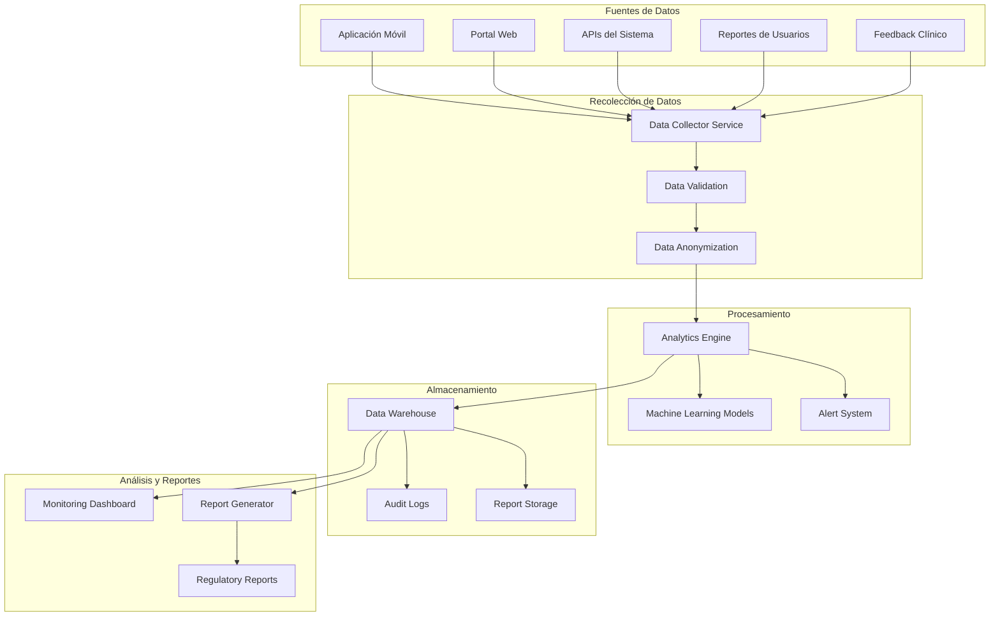
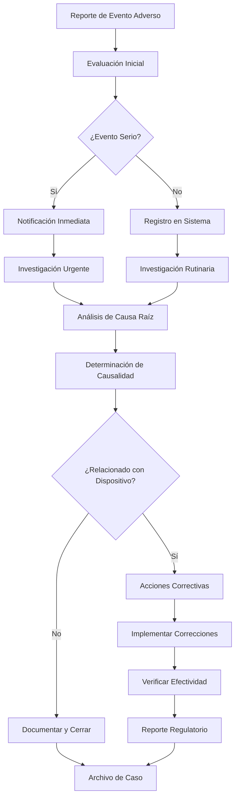
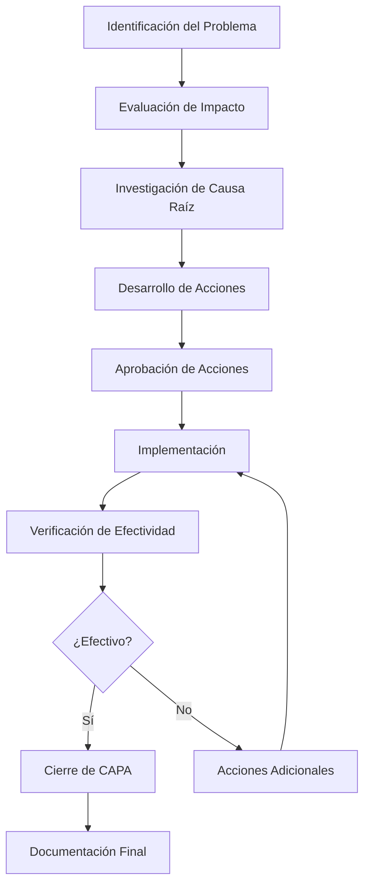

# Procedimientos de Post-Market Surveillance - NeuralHack Cognitive AI

## Resumen Ejecutivo

Este documento establece los procedimientos de vigilancia post-mercado para NeuralHack Cognitive AI, cumpliendo con los requisitos de ISO 14971:2019, regulaciones COFEPRIS y mejores prácticas internacionales para dispositivos médicos de software. El sistema de vigilancia está diseñado para monitorear continuamente la seguridad y efectividad del dispositivo en condiciones de uso real.

## Marco Regulatorio

### Regulaciones Aplicables

#### COFEPRIS (México)
- **Reglamento de Insumos para la Salud** - Artículos sobre vigilancia post-mercado
- **NOM-240-SSA1-2012** - Instalación y operación de la tecnovigilancia
- **Acuerdo por el que se establecen los lineamientos para la tecnovigilancia**

#### Estándares Internacionales
- **ISO 14971:2019** - Gestión de riesgos para dispositivos médicos
- **ISO 13485:2016** - Sistemas de gestión de calidad para dispositivos médicos
- **IEC 62304:2006** - Software de dispositivos médicos
- **FDA 21 CFR Part 820** - Quality System Regulation

#### Regulaciones de Privacidad
- **GDPR** - Para usuarios en la Unión Europea
- **LFTIDPI** - Ley Federal de Transparencia y Acceso a la Información Pública (México)
- **HIPAA** - Para usuarios en Estados Unidos

## Objetivos de la Vigilancia Post-Mercado

### Objetivos Primarios

1. **Monitoreo de Seguridad**
   - Detectar riesgos no identificados durante el desarrollo
   - Verificar la efectividad de las medidas de control de riesgo
   - Identificar nuevos peligros emergentes del uso real

2. **Evaluación de Efectividad**
   - Confirmar el rendimiento clínico en condiciones reales
   - Validar la utilidad clínica del dispositivo
   - Evaluar la satisfacción del usuario

3. **Mejora Continua**
   - Identificar oportunidades de mejora del producto
   - Informar el desarrollo de futuras versiones
   - Optimizar la experiencia del usuario

### Objetivos Secundarios

1. **Cumplimiento Regulatorio**
   - Mantener conformidad con regulaciones aplicables
   - Preparar reportes regulatorios requeridos
   - Documentar evidencia de vigilancia continua

2. **Gestión de Riesgos**
   - Actualizar el análisis de riesgos basado en datos reales
   - Implementar medidas correctivas cuando sea necesario
   - Mantener el perfil riesgo/beneficio favorable

## Sistema de Vigilancia Post-Mercado

### Arquitectura del Sistema



### Componentes del Sistema

#### 1. Recolección Automática de Datos
```typescript
interface PostMarketDataCollection {
  technicalMetrics: {
    systemPerformance: SystemMetrics
    errorRates: ErrorMetrics
    usagePatterns: UsageMetrics
    deviceCompatibility: CompatibilityMetrics
  }
  clinicalData: {
    assessmentResults: AssessmentMetrics
    userOutcomes: OutcomeMetrics
    adverseEvents: AdverseEventMetrics
  }
  userExperience: {
    satisfactionScores: SatisfactionMetrics
    usabilityIssues: UsabilityMetrics
    featureUsage: FeatureMetrics
  }
}

class PostMarketDataCollector {
  async collectTechnicalMetrics(): Promise<SystemMetrics> {
    return {
      uptime: await this.calculateUptime(),
      responseTime: await this.getAverageResponseTime(),
      errorRate: await this.calculateErrorRate(),
      crashRate: await this.getCrashRate(),
      performanceMetrics: await this.getPerformanceMetrics()
    }
  }
  
  async collectClinicalData(): Promise<AssessmentMetrics> {
    return {
      completionRate: await this.getAssessmentCompletionRate(),
      averageDuration: await this.getAverageAssessmentDuration(),
      scoreDistribution: await this.getScoreDistribution(),
      riskCategoryDistribution: await this.getRiskDistribution()
    }
  }
  
  async collectUserFeedback(): Promise<SatisfactionMetrics> {
    return {
      overallSatisfaction: await this.getOverallSatisfaction(),
      easeOfUse: await this.getEaseOfUseRating(),
      clinicalUtility: await this.getClinicalUtilityRating(),
      recommendationScore: await this.getNPSScore()
    }
  }
}
```

#### 2. Sistema de Alertas Automatizadas
```typescript
interface AlertConfiguration {
  technicalAlerts: {
    highErrorRate: {
      threshold: number // 5%
      timeWindow: number // 1 hora
      severity: 'high'
    }
    systemDowntime: {
      threshold: number // 5 minutos
      severity: 'critical'
    }
    performanceDegradation: {
      threshold: number // 50% slower
      timeWindow: number // 30 minutos
      severity: 'medium'
    }
  }
  clinicalAlerts: {
    unusualScorePattern: {
      threshold: number // 2 desviaciones estándar
      severity: 'medium'
    }
    highAbandonmentRate: {
      threshold: number // 20%
      timeWindow: number // 24 horas
      severity: 'high'
    }
  }
  safetyAlerts: {
    adverseEventReported: {
      severity: 'critical'
      immediateNotification: true
    }
    securityIncident: {
      severity: 'critical'
      immediateNotification: true
    }
  }
}

class AlertSystem {
  async processAlert(alert: PostMarketAlert): Promise<void> {
    // Registrar alerta
    await this.logAlert(alert)
    
    // Determinar severidad y destinatarios
    const config = this.getAlertConfiguration(alert.type)
    
    // Enviar notificaciones
    await this.sendNotifications(alert, config)
    
    // Crear ticket de seguimiento
    await this.createFollowupTicket(alert)
    
    // Ejecutar acciones automáticas si están configuradas
    if (config.autoActions) {
      await this.executeAutoActions(alert, config.autoActions)
    }
  }
}
```

## Métricas de Vigilancia

### Indicadores Clave de Rendimiento (KPIs)

#### Métricas de Seguridad
```typescript
interface SafetyMetrics {
  adverseEvents: {
    totalReported: number
    seriousEvents: number
    eventsPerThousandUsers: number
    timeToResolution: number // horas promedio
  }
  technicalFailures: {
    systemFailures: number
    dataCorruption: number
    securityIncidents: number
    failureRate: number // por 1000 usos
  }
  usabilityIssues: {
    userErrors: number
    confusionReports: number
    misinterpretations: number
    usabilityScore: number // 1-10
  }
}
```

#### Métricas de Efectividad
```typescript
interface EffectivenessMetrics {
  clinicalPerformance: {
    sensitivity: number // %
    specificity: number // %
    positivePredicativeValue: number // %
    negativePredicativeValue: number // %
    areaUnderCurve: number
  }
  userSatisfaction: {
    overallSatisfaction: number // 1-10
    clinicalUtility: number // 1-10
    easeOfUse: number // 1-10
    netPromoterScore: number // -100 to 100
  }
  systemPerformance: {
    uptime: number // %
    averageResponseTime: number // ms
    completionRate: number // %
    errorRate: number // %
  }
}
```

#### Métricas de Uso
```typescript
interface UsageMetrics {
  userEngagement: {
    activeUsers: number
    newUsers: number
    returningUsers: number
    sessionDuration: number // minutos promedio
  }
  assessmentMetrics: {
    assessmentsCompleted: number
    averageAssessmentTime: number // minutos
    abandonmentRate: number // %
    retestRate: number // %
  }
  featureUsage: {
    accessibilityFeatures: number // % de usuarios
    voiceGuidance: number // % de uso
    offlineMode: number // % de uso
    dataExport: number // % de usuarios
  }
}
```

### Recolección de Datos

#### Datos Técnicos Automatizados
```typescript
class TechnicalDataCollector {
  async collectSystemMetrics(): Promise<SystemMetrics> {
    const metrics = {
      timestamp: new Date(),
      uptime: await this.getSystemUptime(),
      responseTime: await this.measureResponseTime(),
      memoryUsage: await this.getMemoryUsage(),
      cpuUsage: await this.getCPUUsage(),
      diskUsage: await this.getDiskUsage(),
      networkLatency: await this.measureNetworkLatency(),
      errorCounts: await this.getErrorCounts(),
      activeConnections: await this.getActiveConnections()
    }
    
    // Anonimizar datos antes de almacenar
    return this.anonymizeMetrics(metrics)
  }
  
  async collectApplicationMetrics(): Promise<ApplicationMetrics> {
    return {
      assessmentsStarted: await this.countAssessmentsStarted(),
      assessmentsCompleted: await this.countAssessmentsCompleted(),
      averageCompletionTime: await this.calculateAverageTime(),
      userSessions: await this.countActiveSessions(),
      featureUsage: await this.getFeatureUsageStats(),
      errorsByType: await this.categorizeErrors()
    }
  }
}
```

#### Datos Clínicos
```typescript
class ClinicalDataCollector {
  async collectOutcomeData(): Promise<ClinicalOutcomes> {
    // Datos anonimizados de resultados clínicos
    const outcomes = await this.database.query(`
      SELECT 
        assessment_type,
        risk_category,
        COUNT(*) as count,
        AVG(completion_time) as avg_time,
        STDDEV(score) as score_variance
      FROM assessment_results 
      WHERE created_at >= NOW() - INTERVAL '30 days'
        AND user_consent_research = true
      GROUP BY assessment_type, risk_category
    `)
    
    return this.processOutcomeData(outcomes)
  }
  
  async collectValidationData(): Promise<ValidationMetrics> {
    // Comparación con diagnósticos confirmados (cuando disponible)
    const validationData = await this.database.query(`
      SELECT 
        ar.assessment_type,
        ar.risk_category as predicted_risk,
        cv.confirmed_diagnosis,
        COUNT(*) as cases
      FROM assessment_results ar
      JOIN clinical_validation cv ON ar.user_id = cv.user_id
      WHERE cv.validation_date >= NOW() - INTERVAL '90 days'
      GROUP BY ar.assessment_type, ar.risk_category, cv.confirmed_diagnosis
    `)
    
    return this.calculateValidationMetrics(validationData)
  }
}
```

#### Feedback de Usuarios
```typescript
class UserFeedbackCollector {
  async collectSatisfactionData(): Promise<SatisfactionData> {
    // Encuestas de satisfacción post-evaluación
    const surveys = await this.database.query(`
      SELECT 
        overall_satisfaction,
        ease_of_use,
        clinical_utility,
        recommendation_likelihood,
        feedback_text
      FROM user_satisfaction_surveys
      WHERE created_at >= NOW() - INTERVAL '30 days'
    `)
    
    return this.analyzeSatisfactionData(surveys)
  }
  
  async collectUsabilityIssues(): Promise<UsabilityIssues> {
    // Reportes de problemas de usabilidad
    const issues = await this.database.query(`
      SELECT 
        issue_type,
        severity,
        description,
        user_context,
        resolution_status
      FROM usability_reports
      WHERE created_at >= NOW() - INTERVAL '30 days'
    `)
    
    return this.categorizeUsabilityIssues(issues)
  }
}
```

## Gestión de Eventos Adversos

### Definición de Eventos Adversos

#### Clasificación de Eventos
```typescript
enum AdverseEventSeverity {
  MINOR = 'minor',           // Sin impacto en salud
  MODERATE = 'moderate',     // Impacto temporal en salud
  SERIOUS = 'serious',       // Hospitalización o incapacidad
  LIFE_THREATENING = 'life_threatening', // Riesgo de muerte
  FATAL = 'fatal'           // Muerte
}

enum AdverseEventType {
  TECHNICAL_FAILURE = 'technical_failure',
  MISDIAGNOSIS = 'misdiagnosis',
  DATA_BREACH = 'data_breach',
  USABILITY_ERROR = 'usability_error',
  SYSTEM_UNAVAILABILITY = 'system_unavailability'
}

interface AdverseEvent {
  id: string
  reportDate: Date
  eventDate: Date
  severity: AdverseEventSeverity
  type: AdverseEventType
  description: string
  patientImpact: string
  deviceInvolved: boolean
  reporterType: 'healthcare_professional' | 'patient' | 'caregiver' | 'internal'
  followupRequired: boolean
  regulatoryReportingRequired: boolean
}
```

### Proceso de Gestión de Eventos Adversos



#### Procedimiento de Investigación
```typescript
class AdverseEventInvestigation {
  async investigateEvent(eventId: string): Promise<InvestigationResult> {
    const event = await this.getAdverseEvent(eventId)
    
    // 1. Recolección de evidencia
    const evidence = await this.collectEvidence(event)
    
    // 2. Análisis de causa raíz
    const rootCause = await this.performRootCauseAnalysis(event, evidence)
    
    // 3. Evaluación de causalidad
    const causality = await this.assessCausality(event, rootCause)
    
    // 4. Determinación de acciones
    const actions = await this.determineCorrectiveActions(causality)
    
    // 5. Evaluación de impacto
    const impact = await this.assessImpact(event, causality)
    
    return {
      eventId,
      investigationDate: new Date(),
      rootCause,
      causality,
      recommendedActions: actions,
      impactAssessment: impact,
      investigator: this.getCurrentInvestigator()
    }
  }
  
  async performRootCauseAnalysis(
    event: AdverseEvent, 
    evidence: Evidence[]
  ): Promise<RootCauseAnalysis> {
    // Metodología de los 5 Por Qués
    const whyAnalysis = await this.fiveWhysAnalysis(event, evidence)
    
    // Diagrama de Ishikawa (Causa y Efecto)
    const fishboneAnalysis = await this.fishboneAnalysis(event, evidence)
    
    // Análisis de factores contribuyentes
    const contributingFactors = await this.identifyContributingFactors(evidence)
    
    return {
      primaryCause: whyAnalysis.rootCause,
      contributingFactors,
      systemicIssues: fishboneAnalysis.systemicIssues,
      preventabilityAssessment: await this.assessPreventability(event)
    }
  }
}
```

### Reportes Regulatorios

#### Cronograma de Reportes
```typescript
interface RegulatoryReportingSchedule {
  cofepris: {
    adverseEvents: {
      serious: '24 hours',
      nonSerious: '15 days'
    },
    periodicReports: {
      frequency: 'annual',
      dueDate: 'anniversary_of_approval'
    }
  },
  fda: {
    mdr: {
      serious: '30 days',
      malfunction: '30 days'
    }
  },
  ce: {
    vigilance: {
      serious: 'immediately',
      trend: '30 days'
    }
  }
}

class RegulatoryReporting {
  async generateCOFEPRISReport(
    events: AdverseEvent[], 
    period: DateRange
  ): Promise<COFEPRISReport> {
    return {
      reportType: 'periodic_safety_update',
      reportingPeriod: period,
      deviceInformation: await this.getDeviceInformation(),
      adverseEvents: events.map(e => this.formatForCOFEPRIS(e)),
      riskAssessment: await this.updateRiskAssessment(events),
      correctiveActions: await this.getCorrectiveActions(events),
      conclusions: await this.generateConclusions(events)
    }
  }
}
```

## Análisis de Tendencias

### Detección de Señales de Seguridad

#### Algoritmos de Detección
```typescript
class SafetySignalDetection {
  async detectSafetySignals(): Promise<SafetySignal[]> {
    const signals: SafetySignal[] = []
    
    // 1. Análisis de tendencias temporales
    const temporalTrends = await this.analyzeTemporalTrends()
    signals.push(...this.identifyTemporalSignals(temporalTrends))
    
    // 2. Análisis de patrones de uso
    const usagePatterns = await this.analyzeUsagePatterns()
    signals.push(...this.identifyUsageSignals(usagePatterns))
    
    // 3. Análisis de correlaciones
    const correlations = await this.analyzeCorrelations()
    signals.push(...this.identifyCorrelationSignals(correlations))
    
    // 4. Comparación con datos históricos
    const historicalComparison = await this.compareWithHistorical()
    signals.push(...this.identifyHistoricalSignals(historicalComparison))
    
    return this.prioritizeSignals(signals)
  }
  
  async analyzeTemporalTrends(): Promise<TemporalTrend[]> {
    // Análisis de series temporales para detectar cambios
    const metrics = await this.getTimeSeriesData([
      'error_rate',
      'completion_rate',
      'user_satisfaction',
      'adverse_events'
    ])
    
    return metrics.map(metric => ({
      metric: metric.name,
      trend: this.calculateTrend(metric.data),
      significance: this.calculateSignificance(metric.data),
      changePoint: this.detectChangePoint(metric.data)
    }))
  }
}
```

#### Machine Learning para Detección de Anomalías
```python
# Modelo de detección de anomalías
import numpy as np
from sklearn.ensemble import IsolationForest
from sklearn.preprocessing import StandardScaler

class AnomalyDetectionModel:
    def __init__(self):
        self.model = IsolationForest(contamination=0.1, random_state=42)
        self.scaler = StandardScaler()
        
    def train(self, historical_data):
        """Entrenar modelo con datos históricos normales"""
        scaled_data = self.scaler.fit_transform(historical_data)
        self.model.fit(scaled_data)
        
    def detect_anomalies(self, current_data):
        """Detectar anomalías en datos actuales"""
        scaled_data = self.scaler.transform(current_data)
        anomaly_scores = self.model.decision_function(scaled_data)
        anomalies = self.model.predict(scaled_data)
        
        return {
            'anomalies': anomalies == -1,
            'scores': anomaly_scores,
            'threshold': self.model.threshold_
        }
        
    def explain_anomaly(self, anomalous_data):
        """Explicar qué características contribuyen a la anomalía"""
        feature_importance = self.calculate_feature_importance(anomalous_data)
        return feature_importance

# Uso del modelo
detector = AnomalyDetectionModel()
detector.train(historical_normal_data)
anomalies = detector.detect_anomalies(current_metrics)
```

### Análisis de Efectividad Clínica

#### Métricas de Rendimiento Clínico
```typescript
class ClinicalEffectivenessAnalysis {
  async analyzeClinicalPerformance(): Promise<ClinicalPerformanceReport> {
    // Recopilar datos de validación clínica
    const validationData = await this.getValidationData()
    
    // Calcular métricas de rendimiento
    const performance = this.calculatePerformanceMetrics(validationData)
    
    // Analizar tendencias temporales
    const trends = await this.analyzeTrends(validationData)
    
    // Comparar con objetivos establecidos
    const comparison = this.compareWithTargets(performance)
    
    return {
      reportDate: new Date(),
      performanceMetrics: performance,
      trends,
      targetComparison: comparison,
      recommendations: this.generateRecommendations(performance, trends)
    }
  }
  
  calculatePerformanceMetrics(data: ValidationData[]): PerformanceMetrics {
    const truePositives = data.filter(d => d.predicted === 'positive' && d.actual === 'positive').length
    const trueNegatives = data.filter(d => d.predicted === 'negative' && d.actual === 'negative').length
    const falsePositives = data.filter(d => d.predicted === 'positive' && d.actual === 'negative').length
    const falseNegatives = data.filter(d => d.predicted === 'negative' && d.actual === 'positive').length
    
    const sensitivity = truePositives / (truePositives + falseNegatives)
    const specificity = trueNegatives / (trueNegatives + falsePositives)
    const ppv = truePositives / (truePositives + falsePositives)
    const npv = trueNegatives / (trueNegatives + falseNegatives)
    const accuracy = (truePositives + trueNegatives) / data.length
    
    return {
      sensitivity,
      specificity,
      positivePredicativeValue: ppv,
      negativePredicativeValue: npv,
      accuracy,
      areaUnderCurve: this.calculateAUC(data)
    }
  }
}
```

## Acciones Correctivas y Preventivas (CAPA)

### Proceso CAPA



#### Sistema de Gestión CAPA
```typescript
interface CAPARecord {
  id: string
  initiationDate: Date
  problemDescription: string
  source: 'adverse_event' | 'audit' | 'complaint' | 'internal_review'
  severity: 'low' | 'medium' | 'high' | 'critical'
  rootCause: string
  correctiveActions: Action[]
  preventiveActions: Action[]
  responsiblePerson: string
  targetCompletionDate: Date
  status: 'open' | 'in_progress' | 'verification' | 'closed'
  effectivenessVerification: EffectivenessCheck[]
}

class CAPAManagement {
  async initiateCAPAProcess(problem: ProblemReport): Promise<CAPARecord> {
    // Crear registro CAPA
    const capaRecord = await this.createCAPARecord(problem)
    
    // Asignar responsable
    const responsible = await this.assignResponsible(capaRecord.severity)
    
    // Establecer cronograma
    const timeline = this.establishTimeline(capaRecord.severity)
    
    // Notificar stakeholders
    await this.notifyStakeholders(capaRecord)
    
    return capaRecord
  }
  
  async developCorrectiveActions(capaId: string): Promise<Action[]> {
    const capa = await this.getCAPARecord(capaId)
    const rootCause = await this.getRootCause(capaId)
    
    // Desarrollar acciones correctivas específicas
    const actions = await this.brainstormActions(rootCause)
    
    // Evaluar factibilidad y efectividad
    const evaluatedActions = await this.evaluateActions(actions)
    
    // Priorizar acciones
    const prioritizedActions = this.prioritizeActions(evaluatedActions)
    
    return prioritizedActions
  }
  
  async verifyEffectiveness(capaId: string): Promise<EffectivenessResult> {
    const capa = await this.getCAPARecord(capaId)
    
    // Definir métricas de efectividad
    const metrics = this.defineEffectivenessMetrics(capa)
    
    // Recopilar datos post-implementación
    const postData = await this.collectPostImplementationData(metrics)
    
    // Comparar con datos pre-implementación
    const preData = await this.getPreImplementationData(metrics)
    
    // Analizar mejora
    const improvement = this.analyzeImprovement(preData, postData)
    
    return {
      effective: improvement.significant,
      improvementPercentage: improvement.percentage,
      metrics: improvement.metrics,
      recommendations: improvement.recommendations
    }
  }
}
```

### Ejemplos de Acciones CAPA

#### CAPA-001: Alta Tasa de Abandono en Evaluación MoCA
```typescript
const capaExample: CAPARecord = {
  id: 'CAPA-001',
  initiationDate: new Date('2024-11-15'),
  problemDescription: 'Tasa de abandono del 18% en evaluación MoCA, superior al objetivo del 10%',
  source: 'internal_review',
  severity: 'medium',
  rootCause: 'Instrucciones de dibujo poco claras y interfaz confusa para tareas visuoespaciales',
  correctiveActions: [
    {
      id: 'CA-001-01',
      description: 'Rediseñar interfaz de tareas de dibujo con instrucciones más claras',
      responsible: 'UX Team',
      targetDate: new Date('2024-12-15'),
      status: 'completed'
    },
    {
      id: 'CA-001-02',
      description: 'Implementar tutorial interactivo para tareas de dibujo',
      responsible: 'Development Team',
      targetDate: new Date('2024-12-20'),
      status: 'in_progress'
    }
  ],
  preventiveActions: [
    {
      id: 'PA-001-01',
      description: 'Establecer pruebas de usabilidad obligatorias para nuevas funcionalidades',
      responsible: 'QA Team',
      targetDate: new Date('2025-01-15'),
      status: 'planned'
    }
  ],
  responsiblePerson: 'Product Manager',
  targetCompletionDate: new Date('2025-01-31'),
  status: 'in_progress',
  effectivenessVerification: [
    {
      metric: 'abandonment_rate',
      preValue: 18,
      postValue: 8,
      improvementPercentage: 55.6,
      significant: true
    }
  ]
}
```

## Reportes y Comunicación

### Reportes Internos

#### Reporte Mensual de Vigilancia
```typescript
interface MonthlyVigilanceReport {
  reportPeriod: DateRange
  executiveSummary: {
    keyFindings: string[]
    safetyStatus: 'good' | 'concerning' | 'critical'
    actionItemsCount: number
    trendsIdentified: number
  }
  safetyMetrics: {
    adverseEvents: AdverseEventSummary
    technicalIssues: TechnicalIssueSummary
    usabilityProblems: UsabilityIssueSummary
  }
  effectivenessMetrics: {
    clinicalPerformance: ClinicalPerformanceSummary
    userSatisfaction: UserSatisfactionSummary
    systemPerformance: SystemPerformanceSummary
  }
  trendAnalysis: {
    identifiedTrends: Trend[]
    safetySignals: SafetySignal[]
    recommendations: string[]
  }
  capaStatus: {
    newCAPAs: number
    closedCAPAs: number
    overdueCAPAs: number
    effectivenessVerified: number
  }
  nextSteps: string[]
}

class ReportGenerator {
  async generateMonthlyReport(period: DateRange): Promise<MonthlyVigilanceReport> {
    const safetyData = await this.collectSafetyData(period)
    const effectivenessData = await this.collectEffectivenessData(period)
    const trends = await this.analyzeTrends(period)
    const capaData = await this.getCAPAStatus(period)
    
    return {
      reportPeriod: period,
      executiveSummary: this.generateExecutiveSummary(safetyData, effectivenessData),
      safetyMetrics: this.summarizeSafetyMetrics(safetyData),
      effectivenessMetrics: this.summarizeEffectivenessMetrics(effectivenessData),
      trendAnalysis: trends,
      capaStatus: capaData,
      nextSteps: this.identifyNextSteps(safetyData, effectivenessData, trends)
    }
  }
}
```

#### Dashboard de Vigilancia en Tiempo Real
```typescript
interface VigilanceDashboard {
  realTimeMetrics: {
    systemStatus: 'operational' | 'degraded' | 'down'
    activeUsers: number
    currentErrorRate: number
    responseTime: number
  }
  safetyIndicators: {
    adverseEventsToday: number
    openSafetyIssues: number
    criticalAlerts: number
    lastIncidentDate: Date
  }
  performanceIndicators: {
    completionRate: number
    userSatisfaction: number
    systemUptime: number
    dataQuality: number
  }
  alerts: {
    active: Alert[]
    recent: Alert[]
    escalated: Alert[]
  }
}
```

### Reportes Regulatorios

#### Reporte Anual COFEPRIS
```typescript
class COFEPRISAnnualReport {
  async generateAnnualReport(year: number): Promise<COFEPRISReport> {
    const period = { start: new Date(year, 0, 1), end: new Date(year, 11, 31) }
    
    return {
      deviceInformation: await this.getDeviceInformation(),
      manufacturerInformation: await this.getManufacturerInformation(),
      safetyData: {
        adverseEvents: await this.getAdverseEvents(period),
        technicalFailures: await this.getTechnicalFailures(period),
        usabilityIssues: await this.getUsabilityIssues(period)
      },
      effectivenessData: {
        clinicalPerformance: await this.getClinicalPerformance(period),
        userOutcomes: await this.getUserOutcomes(period),
        realWorldEvidence: await this.getRealWorldEvidence(period)
      },
      riskAssessment: {
        updatedRiskAnalysis: await this.getUpdatedRiskAnalysis(),
        newRisksIdentified: await this.getNewRisks(period),
        riskMitigationEffectiveness: await this.evaluateRiskMitigation()
      },
      correctiveActions: {
        implementedActions: await this.getImplementedActions(period),
        plannedActions: await this.getPlannedActions(),
        effectivenessVerification: await this.getEffectivenessVerification(period)
      },
      conclusions: await this.generateConclusions(period)
    }
  }
}
```

## Mejora Continua del Sistema

### Ciclo de Mejora PDCA

#### Plan (Planificar)
- Identificar oportunidades de mejora basadas en datos de vigilancia
- Establecer objetivos específicos y medibles
- Desarrollar plan de implementación

#### Do (Hacer)
- Implementar mejoras planificadas
- Recopilar datos durante la implementación
- Documentar el proceso

#### Check (Verificar)
- Analizar efectividad de las mejoras
- Comparar resultados con objetivos
- Identificar desviaciones

#### Act (Actuar)
- Estandarizar mejoras exitosas
- Ajustar o eliminar mejoras no efectivas
- Planificar siguiente ciclo de mejora

### Programa de Mejora Continua
```typescript
class ContinuousImprovementProgram {
  async identifyImprovementOpportunities(): Promise<ImprovementOpportunity[]> {
    const opportunities: ImprovementOpportunity[] = []
    
    // Analizar datos de vigilancia
    const vigilanceData = await this.getVigilanceData()
    opportunities.push(...this.analyzeVigilanceData(vigilanceData))
    
    // Analizar feedback de usuarios
    const userFeedback = await this.getUserFeedback()
    opportunities.push(...this.analyzeUserFeedback(userFeedback))
    
    // Analizar tendencias de la industria
    const industryTrends = await this.getIndustryTrends()
    opportunities.push(...this.analyzeIndustryTrends(industryTrends))
    
    // Priorizar oportunidades
    return this.prioritizeOpportunities(opportunities)
  }
  
  async implementImprovement(opportunity: ImprovementOpportunity): Promise<ImprovementResult> {
    // Desarrollar plan de implementación
    const plan = await this.developImplementationPlan(opportunity)
    
    // Ejecutar plan
    const execution = await this.executeImplementationPlan(plan)
    
    // Monitorear resultados
    const monitoring = await this.monitorImplementation(execution)
    
    // Evaluar efectividad
    const effectiveness = await this.evaluateEffectiveness(monitoring)
    
    return {
      opportunity,
      plan,
      execution,
      effectiveness,
      recommendations: this.generateRecommendations(effectiveness)
    }
  }
}
```

## Conclusiones y Próximos Pasos

### Estado Actual del Sistema de Vigilancia

El sistema de vigilancia post-mercado de NeuralHack Cognitive AI está diseñado para:

1. **Monitoreo Continuo**: Recopilación automática de datos de seguridad y efectividad
2. **Detección Temprana**: Identificación proactiva de problemas y tendencias
3. **Respuesta Rápida**: Procesos establecidos para investigación y corrección
4. **Mejora Continua**: Ciclo sistemático de mejora basado en evidencia

### Próximos Pasos

#### Q1 2025
- [ ] Finalizar implementación del sistema de vigilancia
- [ ] Capacitar al equipo en procedimientos de vigilancia
- [ ] Establecer acuerdos con socios clínicos para validación
- [ ] Implementar dashboard de vigilancia en tiempo real

#### Q2 2025
- [ ] Generar primer reporte trimestral de vigilancia
- [ ] Completar primera revisión del análisis de riesgos
- [ ] Implementar mejoras identificadas en el primer trimestre
- [ ] Preparar primer reporte anual para COFEPRIS

#### Q3-Q4 2025
- [ ] Evaluar efectividad del sistema de vigilancia
- [ ] Implementar mejoras al sistema basadas en experiencia
- [ ] Expandir vigilancia a nuevos mercados
- [ ] Desarrollar capacidades de machine learning para detección

### Compromiso con la Vigilancia

NeuralHack Technologies se compromete a mantener un sistema robusto de vigilancia post-mercado que asegure la seguridad continua y la efectividad de NeuralHack Cognitive AI. Este compromiso incluye:

- Inversión continua en tecnología de vigilancia
- Capacitación regular del personal
- Colaboración con autoridades regulatorias
- Transparencia en la comunicación de hallazgos
- Mejora continua basada en evidencia

---

**Documento**: Procedimientos de Post-Market Surveillance v1.0  
**Fecha**: Diciembre 2024  
**Autor**: Equipo de Vigilancia Post-Mercado NeuralHack  
**Revisión**: Dr. Carlos Mendoza, Director Regulatorio  
**Próxima Actualización**: Marzo 2025

## Anexos

### Anexo A: Formularios de Reporte de Eventos Adversos
### Anexo B: Procedimientos de Investigación Detallados
### Anexo C: Plantillas de Reportes Regulatorios
### Anexo D: Cronograma de Actividades de Vigilancia
### Anexo E: Contactos de Emergencia y Escalación