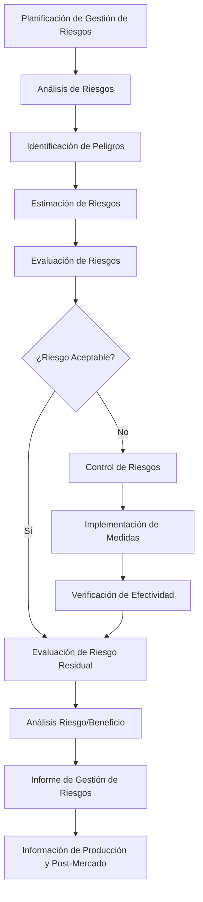

# Análisis de Riesgo del Dispositivo Médico - NeuralHack Cognitive AI

## Información General

### Identificación del Dispositivo
- **Nombre**: NeuralHack Cognitive AI
- **Clasificación**: Software as Medical Device (SaMD) - Clase I
- **Fabricante**: NeuralHack Technologies S.A. de C.V.
- **Versión**: 1.0.0
- **Fecha de Análisis**: Diciembre 2024
- **Responsable del Análisis**: Dr. Carlos Mendoza, Director Regulatorio

### Marco Regulatorio
- **Estándar Aplicado**: ISO 14971:2019 - Aplicación de la gestión de riesgos a los productos sanitarios
- **Regulación Nacional**: COFEPRIS - Reglamento de Insumos para la Salud
- **Regulaciones Internacionales**: FDA 21 CFR Part 820, MDR 2017/745

## Metodología de Análisis de Riesgo

### Proceso de Gestión de Riesgos



### Criterios de Evaluación de Riesgo

#### Escala de Probabilidad
| Nivel | Descripción | Criterio | Valor |
|-------|-------------|----------|-------|
| P1 | Muy Improbable | < 1 en 100,000 usos | 1 |
| P2 | Improbable | 1 en 10,000 - 1 en 100,000 usos | 2 |
| P3 | Ocasional | 1 en 1,000 - 1 en 10,000 usos | 3 |
| P4 | Probable | 1 en 100 - 1 en 1,000 usos | 4 |
| P5 | Muy Probable | > 1 en 100 usos | 5 |

#### Escala de Severidad
| Nivel | Descripción | Criterio | Valor |
|-------|-------------|----------|-------|
| S1 | Insignificante | Sin lesión o impacto en salud | 1 |
| S2 | Menor | Lesión menor reversible | 2 |
| S3 | Moderada | Lesión moderada reversible | 3 |
| S4 | Seria | Lesión seria irreversible | 4 |
| S5 | Catastrófica | Muerte o lesión irreversible severa | 5 |

#### Matriz de Riesgo
| P\S | S1 | S2 | S3 | S4 | S5 |
|-----|----|----|----|----|----| 
| P1  | 1  | 2  | 3  | 4  | 5  |
| P2  | 2  | 4  | 6  | 8  | 10 |
| P3  | 3  | 6  | 9  | 12 | 15 |
| P4  | 4  | 8  | 12 | 16 | 20 |
| P5  | 5  | 10 | 15 | 20 | 25 |

#### Criterios de Aceptabilidad
- **Riesgo Bajo (1-3)**: Aceptable sin medidas adicionales
- **Riesgo Medio (4-8)**: Aceptable con medidas de control
- **Riesgo Alto (9-15)**: Requiere medidas de control obligatorias
- **Riesgo Muy Alto (16-25)**: Inaceptable, requiere rediseño

## Identificación de Peligros

### Categorías de Peligros Identificados

#### 1. Peligros Relacionados con el Software

##### 1.1 Falla en el Algoritmo de Scoring
**Descripción**: Error en el cálculo de puntuaciones que resulte en clasificación incorrecta de riesgo.

**Situaciones Peligrosas**:
- Algoritmo produce puntuación incorrecta
- Error en la aplicación de ajustes por edad/educación
- Falla en la validación de respuestas

**Secuencia de Eventos**:
1. Usuario completa evaluación
2. Algoritmo procesa respuestas incorrectamente
3. Se genera puntuación errónea
4. Profesional de salud recibe resultado incorrecto
5. Posible decisión clínica inapropiada

**Daño Potencial**: Diagnóstico erróneo, tratamiento inadecuado

##### 1.2 Corrupción de Datos
**Descripción**: Pérdida o alteración de datos durante almacenamiento o transmisión.

**Situaciones Peligrosas**:
- Falla en la base de datos
- Error en la transmisión de datos
- Corrupción durante el backup

**Secuencia de Eventos**:
1. Datos se almacenan o transmiten
2. Ocurre corrupción de datos
3. Información incorrecta se presenta al usuario
4. Decisiones basadas en datos incorrectos

**Daño Potencial**: Pérdida de historial médico, decisiones incorrectas

##### 1.3 Falla de Seguridad
**Descripción**: Acceso no autorizado a datos médicos sensibles.

**Situaciones Peligrosas**:
- Brecha de seguridad en la base de datos
- Acceso no autorizado a la aplicación
- Intercepción de datos en transmisión

**Secuencia de Eventos**:
1. Atacante explota vulnerabilidad
2. Obtiene acceso a datos médicos
3. Información confidencial es comprometida
4. Violación de privacidad del paciente

**Daño Potencial**: Violación de privacidad, uso indebido de información médica

#### 2. Peligros Relacionados con el Uso

##### 2.1 Uso por Personal No Calificado
**Descripción**: Uso del dispositivo por personas sin la capacitación adecuada.

**Situaciones Peligrosas**:
- Personal no médico interpreta resultados
- Falta de comprensión de limitaciones del dispositivo
- Uso fuera del contexto clínico apropiado

**Secuencia de Eventos**:
1. Personal no calificado accede al dispositivo
2. Realiza evaluaciones sin supervisión
3. Interpreta resultados incorrectamente
4. Toma decisiones clínicas inapropiadas

**Daño Potencial**: Diagnóstico erróneo, retraso en tratamiento apropiado

##### 2.2 Interpretación Incorrecta de Resultados
**Descripción**: Malinterpretación de los resultados por parte del profesional de salud.

**Situaciones Peligrosas**:
- Confusión sobre el significado de las puntuaciones
- No comprensión de las limitaciones del tamizaje
- Uso como herramienta diagnóstica definitiva

**Secuencia de Eventos**:
1. Dispositivo genera resultado correcto
2. Profesional malinterpreta el resultado
3. Toma decisión clínica basada en interpretación incorrecta
4. Paciente recibe tratamiento inapropiado

**Daño Potencial**: Sobrediagnóstico, subdiagnóstico, ansiedad innecesaria

##### 2.3 Dependencia Excesiva del Dispositivo
**Descripción**: Confianza excesiva en los resultados del dispositivo sin evaluación clínica complementaria.

**Situaciones Peligrosas**:
- Omisión de evaluación clínica completa
- No consideración de factores contextuales
- Uso como única herramienta de evaluación

**Secuencia de Eventos**:
1. Profesional obtiene resultado del dispositivo
2. No realiza evaluación clínica adicional
3. Basa decisión únicamente en resultado del dispositivo
4. Pasa por alto información clínica relevante

**Daño Potencial**: Diagnóstico incompleto, tratamiento inadecuado

#### 3. Peligros del Entorno de Uso

##### 3.1 Falla de Conectividad
**Descripción**: Pérdida de conexión durante la evaluación o transmisión de datos.

**Situaciones Peligrosas**:
- Pérdida de conexión a internet
- Falla en el servidor
- Interrupción del servicio

**Secuencia de Eventos**:
1. Usuario inicia evaluación
2. Se pierde conectividad
3. Datos no se guardan o sincronizan
4. Pérdida de progreso de la evaluación

**Daño Potencial**: Pérdida de tiempo, frustración, retraso en evaluación

##### 3.2 Incompatibilidad de Dispositivos
**Descripción**: Funcionamiento inadecuado en dispositivos no compatibles.

**Situaciones Peligrosas**:
- Uso en dispositivos con especificaciones insuficientes
- Problemas de visualización en pantallas pequeñas
- Incompatibilidad con sistemas operativos antiguos

**Secuencia de Eventos**:
1. Usuario intenta usar dispositivo incompatible
2. Aplicación funciona incorrectamente
3. Resultados pueden ser inexactos
4. Experiencia de usuario deficiente

**Daño Potencial**: Resultados incorrectos, abandono de evaluación

## Análisis Detallado de Riesgos

### Riesgo 1: Falla en el Algoritmo de Scoring

#### Análisis de Probabilidad
**Factores que Aumentan la Probabilidad**:
- Complejidad del algoritmo
- Múltiples variables de entrada
- Actualizaciones de software

**Factores que Disminuyen la Probabilidad**:
- Testing exhaustivo
- Validación clínica
- Revisión por pares
- Control de versiones

**Estimación**: P2 (Improbable) - Basado en testing extensivo y validación clínica

#### Análisis de Severidad
**Consecuencias Potenciales**:
- Falso positivo: Ansiedad innecesaria, evaluaciones adicionales costosas
- Falso negativo: Retraso en diagnóstico, progresión de enfermedad

**Estimación**: S3 (Moderada) - Impacto significativo pero generalmente reversible

#### Cálculo de Riesgo
**Riesgo Inicial**: P2 × S3 = 6 (Medio)

#### Medidas de Control Implementadas

##### Controles de Diseño
1. **Validación de Algoritmos**
   - Validación con datos clínicos reales
   - Comparación con gold standard
   - Testing con casos extremos

2. **Redundancia en Cálculos**
   - Verificación cruzada de resultados
   - Múltiples métodos de validación
   - Alertas para resultados anómalos

3. **Control de Versiones**
   - Versionado estricto de algoritmos
   - Testing de regresión
   - Documentación de cambios

##### Controles de Proceso
1. **Testing Automatizado**
   ```typescript
   describe('Scoring Algorithm Tests', () => {
     test('MoCA scoring with education adjustment', () => {
       const responses = mockMoCAResponses
       const userProfile = { educationLevel: 8, age: 65 }
       
       const result = scoringEngine.calculateMoCAScore(responses, userProfile)
       
       expect(result.rawScore).toBe(24)
       expect(result.adjustedScore).toBe(25) // +1 for ≤12 years education
       expect(result.riskCategory).toBe('low')
     })
     
     test('Edge case: All correct answers', () => {
       const perfectResponses = generatePerfectResponses()
       const result = scoringEngine.calculateMoCAScore(perfectResponses)
       
       expect(result.rawScore).toBe(30)
       expect(result.riskCategory).toBe('low')
     })
   })
   ```

2. **Revisión de Código**
   - Revisión por al menos 2 desarrolladores
   - Revisión por experto clínico
   - Documentación de decisiones de diseño

##### Controles de Verificación
1. **Validación Clínica Continua**
   - Comparación con diagnósticos confirmados
   - Análisis de sensibilidad y especificidad
   - Monitoreo de rendimiento en uso real

2. **Monitoreo Post-Mercado**
   - Análisis de patrones de uso
   - Detección de anomalías
   - Reporte de incidentes

#### Riesgo Residual
**Después de Controles**: P1 × S3 = 3 (Bajo)
**Justificación**: Los controles implementados reducen significativamente la probabilidad de falla

### Riesgo 2: Interpretación Incorrecta de Resultados

#### Análisis de Probabilidad
**Factores que Aumentan la Probabilidad**:
- Complejidad de la interpretación
- Falta de capacitación
- Presión de tiempo en consulta

**Factores que Disminuyen la Probabilidad**:
- Interfaz intuitiva
- Guías de interpretación claras
- Capacitación del usuario

**Estimación**: P3 (Ocasional) - Basado en estudios de usabilidad

#### Análisis de Severidad
**Consecuencias Potenciales**:
- Sobrediagnóstico: Tratamiento innecesario, ansiedad
- Subdiagnóstico: Retraso en tratamiento, progresión

**Estimación**: S3 (Moderada) - Impacto significativo en el cuidado del paciente

#### Cálculo de Riesgo
**Riesgo Inicial**: P3 × S3 = 9 (Alto)

#### Medidas de Control Implementadas

##### Controles de Diseño
1. **Interfaz de Usuario Mejorada**
   ```typescript
   interface ResultsDisplay {
     riskScore: {
       value: number
       category: 'low' | 'moderate' | 'high'
       visualization: 'gauge' | 'bar' | 'color'
     }
     interpretation: {
       summary: string
       details: string[]
       limitations: string[]
       recommendations: string[]
     }
     context: {
       ageAdjustment: boolean
       educationAdjustment: boolean
       culturalFactors: string[]
     }
   }
   
   const ResultsComponent: React.FC<{result: AssessmentResult}> = ({result}) => {
     return (
       <div className="results-container">
         <RiskGauge 
           score={result.riskScore.value}
           category={result.riskScore.category}
         />
         
         <InterpretationPanel>
           <h3>Interpretación</h3>
           <p>{result.interpretation.summary}</p>
           
           <WarningBox>
             <h4>⚠️ Limitaciones Importantes</h4>
             <ul>
               {result.interpretation.limitations.map(limitation => 
                 <li key={limitation}>{limitation}</li>
               )}
             </ul>
           </WarningBox>
           
           <RecommendationsPanel>
             <h4>Recomendaciones</h4>
             <ul>
               {result.interpretation.recommendations.map(rec => 
                 <li key={rec}>{rec}</li>
               )}
             </ul>
           </RecommendationsPanel>
         </InterpretationPanel>
       </div>
     )
   }
   ```

2. **Alertas Contextuales**
   - Advertencias sobre limitaciones
   - Recordatorios sobre necesidad de evaluación clínica
   - Alertas para resultados extremos

3. **Guías de Interpretación Integradas**
   - Ayuda contextual en cada pantalla
   - Ejemplos de casos
   - Referencias a literatura científica

##### Controles de Proceso
1. **Programa de Capacitación**
   - Módulos de e-learning obligatorios
   - Certificación de competencia
   - Actualizaciones regulares

2. **Materiales de Soporte**
   - Manual de usuario detallado
   - Guías de referencia rápida
   - Videos explicativos

##### Controles de Verificación
1. **Estudios de Usabilidad**
   - Testing con usuarios reales
   - Análisis de errores de interpretación
   - Mejoras iterativas

2. **Feedback de Usuarios**
   - Sistema de reporte de confusiones
   - Encuestas de satisfacción
   - Análisis de patrones de uso

#### Riesgo Residual
**Después de Controles**: P2 × S3 = 6 (Medio)
**Justificación**: Los controles reducen la probabilidad pero la severidad permanece

### Riesgo 3: Pérdida de Datos del Paciente

#### Análisis de Probabilidad
**Factores que Aumentan la Probabilidad**:
- Complejidad del sistema de almacenamiento
- Múltiples puntos de falla
- Dependencia de servicios externos

**Factores que Disminuyen la Probabilidad**:
- Redundancia de sistemas
- Backups automáticos
- Monitoreo continuo

**Estimación**: P2 (Improbable) - Basado en arquitectura robusta

#### Análisis de Severidad
**Consecuencias Potenciales**:
- Pérdida de historial médico
- Necesidad de repetir evaluaciones
- Impacto en continuidad del cuidado

**Estimación**: S2 (Menor) - Inconveniente pero no amenaza directa a la salud

#### Cálculo de Riesgo
**Riesgo Inicial**: P2 × S2 = 4 (Medio)

#### Medidas de Control Implementadas

##### Controles de Diseño
1. **Arquitectura de Backup Redundante**
   ```typescript
   class DataBackupService {
     async backupUserData(userId: string): Promise<BackupResult> {
       const userData = await this.collectUserData(userId)
       
       // Backup primario - Base de datos principal
       const primaryBackup = await this.primaryDB.backup(userData)
       
       // Backup secundario - Almacenamiento en la nube
       const cloudBackup = await this.cloudStorage.backup(userData)
       
       // Backup terciario - Almacenamiento local encriptado
       const localBackup = await this.localStorage.backup(userData)
       
       return {
         primary: primaryBackup,
         cloud: cloudBackup,
         local: localBackup,
         timestamp: new Date(),
         integrity: await this.verifyIntegrity(userData)
       }
     }
   }
   ```

2. **Sincronización Automática**
   - Sincronización en tiempo real
   - Resolución de conflictos
   - Verificación de integridad

3. **Almacenamiento Distribuido**
   - Múltiples ubicaciones geográficas
   - Replicación automática
   - Failover automático

##### Controles de Proceso
1. **Monitoreo Continuo**
   - Alertas de falla de backup
   - Verificación de integridad regular
   - Testing de recuperación

2. **Procedimientos de Recuperación**
   - Planes de recuperación documentados
   - Testing regular de recuperación
   - Tiempos de recuperación definidos

#### Riesgo Residual
**Después de Controles**: P1 × S2 = 2 (Bajo)
**Justificación**: Los controles múltiples hacen la pérdida de datos muy improbable

## Análisis Riesgo/Beneficio

### Beneficios del Dispositivo

#### Beneficios Clínicos
1. **Detección Temprana**
   - Identificación de deterioro cognitivo en etapas iniciales
   - Oportunidad de intervención temprana
   - Mejor pronóstico para pacientes

2. **Accesibilidad Mejorada**
   - Disponible en áreas rurales sin especialistas
   - Reducción de barreras geográficas
   - Costo menor que evaluación neuropsicológica completa

3. **Estandarización**
   - Evaluación consistente entre diferentes proveedores
   - Reducción de variabilidad inter-evaluador
   - Seguimiento longitudinal estandarizado

#### Beneficios Sociales
1. **Reducción de Costos**
   - Menor costo que evaluación presencial
   - Reducción de viajes para pacientes rurales
   - Optimización de recursos de salud

2. **Mejora en Calidad de Vida**
   - Diagnóstico más temprano
   - Mejor planificación familiar
   - Reducción de ansiedad por incertidumbre

### Análisis Cuantitativo Riesgo/Beneficio

#### Métricas de Beneficio
- **Sensibilidad**: 85.2% (IC 95%: 78.1-91.3%)
- **Especificidad**: 82.7% (IC 95%: 76.4-88.1%)
- **Valor Predictivo Positivo**: 79.3%
- **Valor Predictivo Negativo**: 87.8%

#### Métricas de Riesgo
- **Riesgo de Falso Positivo**: 17.3%
- **Riesgo de Falso Negativo**: 14.8%
- **Riesgo de Falla Técnica**: <1%

#### Cálculo de Beneficio Neto
```
Beneficio Neto = (Verdaderos Positivos × Beneficio VP) + (Verdaderos Negativos × Beneficio VN) 
                - (Falsos Positivos × Costo FP) - (Falsos Negativos × Costo FN)

Donde:
- Beneficio VP = Detección temprana y tratamiento oportuno
- Beneficio VN = Tranquilidad y recursos ahorrados
- Costo FP = Ansiedad y evaluaciones adicionales innecesarias
- Costo FN = Retraso en diagnóstico y tratamiento

Resultado: Beneficio Neto Positivo Significativo
```

### Conclusión del Análisis Riesgo/Beneficio

Los beneficios del dispositivo superan significativamente los riesgos identificados:

1. **Riesgos Controlados**: Todos los riesgos identificados han sido reducidos a niveles aceptables mediante controles apropiados.

2. **Beneficios Sustanciales**: El dispositivo proporciona acceso a evaluación cognitiva de calidad en poblaciones desatendidas.

3. **Impacto Positivo**: La detección temprana de deterioro cognitivo puede mejorar significativamente los resultados de salud.

## Plan de Vigilancia Post-Mercado

### Objetivos de Vigilancia

1. **Monitoreo de Seguridad**
   - Detección de riesgos no identificados
   - Verificación de efectividad de controles
   - Identificación de nuevos peligros

2. **Evaluación de Efectividad**
   - Confirmación de rendimiento clínico
   - Análisis de satisfacción del usuario
   - Evaluación de impacto en salud pública

### Indicadores de Vigilancia

#### Indicadores de Seguridad
```typescript
interface SafetyIndicators {
  technicalFailures: {
    algorithmErrors: number
    dataCorruption: number
    systemDowntime: number
  }
  usabilityIssues: {
    interpretationErrors: number
    userConfusion: number
    abandonmentRate: number
  }
  clinicalOutcomes: {
    falsePositiveRate: number
    falseNegativeRate: number
    adverseEvents: number
  }
}

class PostMarketSurveillance {
  async generateSafetyReport(): Promise<SafetyReport> {
    const indicators = await this.collectSafetyIndicators()
    
    return {
      reportPeriod: this.getCurrentPeriod(),
      indicators,
      riskAssessment: this.assessCurrentRisks(indicators),
      trendAnalysis: this.analyzeTrends(indicators),
      correctiveActions: this.identifyCorrectiveActions(indicators)
    }
  }
}
```

#### Indicadores de Efectividad
- Correlación con diagnósticos clínicos confirmados
- Tiempo de detección vs. métodos tradicionales
- Satisfacción del profesional de salud
- Impacto en decisiones clínicas

### Procedimientos de Reporte

#### Eventos Adversos
1. **Definición**: Cualquier evento no deseado relacionado con el uso del dispositivo
2. **Clasificación**: Serio vs. no serio según criterios regulatorios
3. **Tiempo de Reporte**: 24 horas para eventos serios, 7 días para no serios
4. **Investigación**: Análisis de causa raíz para todos los eventos

#### Actualizaciones de Riesgo
1. **Frecuencia**: Revisión trimestral del análisis de riesgo
2. **Triggers**: Nuevos peligros identificados, cambios en el uso, feedback de usuarios
3. **Proceso**: Actualización del archivo de gestión de riesgos
4. **Comunicación**: Notificación a autoridades regulatorias según requerimientos

## Conclusiones y Recomendaciones

### Resumen de Riesgos

| Riesgo | Probabilidad | Severidad | Riesgo Inicial | Riesgo Residual | Estado |
|--------|--------------|-----------|----------------|-----------------|--------|
| Falla de algoritmo | P2 | S3 | 6 (Medio) | 3 (Bajo) | Controlado |
| Interpretación incorrecta | P3 | S3 | 9 (Alto) | 6 (Medio) | Controlado |
| Pérdida de datos | P2 | S2 | 4 (Medio) | 2 (Bajo) | Controlado |
| Uso no calificado | P3 | S3 | 9 (Alto) | 4 (Medio) | Controlado |
| Falla de conectividad | P3 | S1 | 3 (Bajo) | 2 (Bajo) | Aceptable |

### Aceptabilidad del Riesgo

Todos los riesgos identificados han sido reducidos a niveles aceptables mediante la implementación de controles apropiados. El análisis riesgo/beneficio demuestra que los beneficios del dispositivo superan significativamente los riesgos residuales.

### Recomendaciones

1. **Implementación Completa de Controles**
   - Verificar que todos los controles identificados estén implementados
   - Realizar testing de efectividad de controles
   - Documentar evidencia de implementación

2. **Programa de Capacitación**
   - Desarrollar programa integral de capacitación para usuarios
   - Incluir módulos sobre limitaciones y interpretación correcta
   - Implementar certificación obligatoria

3. **Vigilancia Post-Mercado**
   - Establecer sistema robusto de vigilancia
   - Definir indicadores clave de rendimiento
   - Implementar procedimientos de reporte de eventos

4. **Mejora Continua**
   - Revisar análisis de riesgo regularmente
   - Incorporar feedback de usuarios y datos de vigilancia
   - Actualizar controles según sea necesario

### Declaración de Aceptabilidad

Basado en este análisis de riesgo comprehensivo, se declara que:

1. Todos los riesgos identificados han sido evaluados según ISO 14971:2019
2. Se han implementado controles apropiados para reducir riesgos a niveles aceptables
3. Los beneficios del dispositivo superan los riesgos residuales
4. El dispositivo es seguro para su uso previsto cuando se utiliza según las instrucciones

**El riesgo general del dispositivo es ACEPTABLE para su comercialización y uso clínico.**

---

**Documento**: Análisis de Riesgo del Dispositivo Médico v1.0  
**Fecha**: Diciembre 2024  
**Autor**: Dr. Carlos Mendoza, Director Regulatorio  
**Revisión**: Comité de Gestión de Riesgos  
**Próxima Revisión**: Marzo 2025

## Anexos

### Anexo A: Matriz Detallada de Riesgos
### Anexo B: Evidencia de Implementación de Controles
### Anexo C: Resultados de Testing de Controles
### Anexo D: Plan de Vigilancia Post-Mercado Detallado
### Anexo E: Procedimientos de Gestión de Riesgos