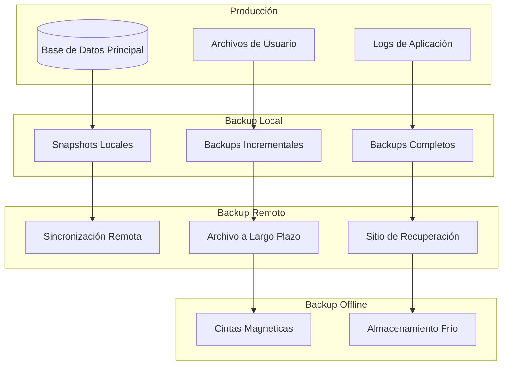

# Procedimientos de Backup y Recuperación - NeuralHack Cognitive AI

## Resumen Ejecutivo

Este documento establece los procedimientos completos de backup y recuperación de datos para NeuralHack Cognitive AI, asegurando la continuidad del negocio y el cumplimiento con regulaciones de retención de datos médicos.

## Objetivos de Backup

### Objetivos de Nivel de Servicio (SLO)

#### Recovery Time Objective (RTO)
- **Servicios Críticos**: 2 horas máximo
- **Servicios Importantes**: 4 horas máximo
- **Servicios de Soporte**: 8 horas máximo

#### Recovery Point Objective (RPO)
- **Datos Médicos**: 15 minutos máximo
- **Datos de Usuario**: 1 hora máximo
- **Datos de Configuración**: 4 horas máximo
- **Logs y Métricas**: 24 horas máximo

#### Disponibilidad Objetivo
- **Uptime**: 99.9% (8.76 horas de downtime/año)
- **Integridad de Datos**: 99.99%
- **Tiempo de Recuperación Promedio**: 1 hora

## Arquitectura de Backup

### Estrategia 3-2-1-1-0

- **3 Copias**: 1 original + 2 backups
- **2 Tipos de Media**: Disco y nube
- **1 Copia Offsite**: Región geográfica diferente
- **1 Copia Offline**: Desconectada de la red
- **0 Errores**: Verificación completa de integridad

### Topología de Backup



## Tipos de Backup

### Backup Completo (Full Backup)

#### Configuración
- **Frecuencia**: Semanal (Domingos 2:00 AM)
- **Duración Estimada**: 4-6 horas
- **Ventana de Mantenimiento**: 2:00 AM - 8:00 AM
- **Retención**: 12 semanas

#### Implementación
```typescript
interface FullBackupConfiguration {
  schedule: {
    dayOfWeek: 0 // Domingo
    hour: 2
    minute: 0
    timezone: 'America/Mexico_City'
  }
  scope: {
    databases: string[]
    fileSystemPaths: string[]
    configurations: string[]
    certificates: string[]
  }
  compression: {
    algorithm: 'lz4' | 'gzip' | 'zstd'
    level: number
  }
  encryption: {
    algorithm: 'AES-256-GCM'
    keyRotation: boolean
  }
  verification: {
    checksumValidation: boolean
    sampleRestoration: boolean
  }
}

class FullBackupService {
  async executeFullBackup(): Promise<BackupResult> {
    const backupId = this.generateBackupId('FULL')
    const startTime = new Date()
    
    try {
      // 1. Preparar entorno de backup
      await this.prepareBackupEnvironment()
      
      // 2. Crear snapshot consistente
      const snapshot = await this.createConsistentSnapshot()
      
      // 3. Comprimir datos
      const compressedData = await this.compressBackupData(snapshot)
      
      // 4. Encriptar backup
      const encryptedBackup = await this.encryptBackup(compressedData)
      
      // 5. Transferir a almacenamiento
      const storageLocation = await this.transferToStorage(encryptedBackup)
      
      // 6. Verificar integridad
      await this.verifyBackupIntegrity(storageLocation)
      
      // 7. Actualizar catálogo de backups
      await this.updateBackupCatalog({
        id: backupId,
        type: 'full',
        startTime,
        endTime: new Date(),
        size: encryptedBackup.length,
        location: storageLocation,
        checksum: this.calculateChecksum(encryptedBackup)
      })
      
      return {
        success: true,
        backupId,
        duration: Date.now() - startTime.getTime(),
        size: encryptedBackup.length
      }
      
    } catch (error) {
      await this.handleBackupFailure(backupId, error)
      throw error
    }
  }
  
  private async createConsistentSnapshot(): Promise<BackupSnapshot> {
    // Pausar escrituras temporalmente
    await this.pauseWrites()
    
    try {
      // Crear snapshot de base de datos
      const dbSnapshot = await this.createDatabaseSnapshot()
      
      // Crear snapshot de archivos
      const fileSnapshot = await this.createFileSystemSnapshot()
      
      // Crear snapshot de configuraciones
      const configSnapshot = await this.createConfigurationSnapshot()
      
      return {
        timestamp: new Date(),
        database: dbSnapshot,
        files: fileSnapshot,
        configurations: configSnapshot
      }
    } finally {
      // Reanudar escrituras
      await this.resumeWrites()
    }
  }
}
```

### Backup Incremental

#### Configuración
- **Frecuencia**: Diario (Lunes-Sábado 3:00 AM)
- **Duración Estimada**: 30-60 minutos
- **Retención**: 30 días
- **Dependencia**: Último backup completo

#### Implementación
```typescript
class IncrementalBackupService {
  async executeIncrementalBackup(): Promise<BackupResult> {
    const lastBackup = await this.getLastBackupTimestamp()
    const backupId = this.generateBackupId('INCR')
    
    try {
      // Identificar cambios desde último backup
      const changes = await this.identifyChanges(lastBackup.timestamp)
      
      if (changes.isEmpty()) {
        return { success: true, message: 'No changes detected' }
      }
      
      // Crear backup solo de cambios
      const incrementalData = await this.createIncrementalBackup(changes)
      
      // Comprimir y encriptar
      const processedBackup = await this.processBackupData(incrementalData)
      
      // Almacenar
      const location = await this.storeBackup(processedBackup, 'incremental')
      
      // Verificar
      await this.verifyIncrementalBackup(location, changes)
      
      return {
        success: true,
        backupId,
        changesCount: changes.count(),
        size: processedBackup.length
      }
      
    } catch (error) {
      await this.handleIncrementalBackupFailure(backupId, error)
      throw error
    }
  }
  
  private async identifyChanges(since: Date): Promise<ChangeSet> {
    const dbChanges = await this.identifyDatabaseChanges(since)
    const fileChanges = await this.identifyFileChanges(since)
    const configChanges = await this.identifyConfigurationChanges(since)
    
    return new ChangeSet({
      database: dbChanges,
      files: fileChanges,
      configurations: configChanges,
      timestamp: new Date()
    })
  }
}
```

### Backup Diferencial

#### Configuración
- **Frecuencia**: Cada 6 horas
- **Duración Estimada**: 1-2 horas
- **Retención**: 7 días
- **Dependencia**: Último backup completo

### Snapshots en Tiempo Real

#### Configuración
- **Frecuencia**: Cada hora
- **Retención**: 24 horas
- **Propósito**: Recuperación rápida de cambios recientes

```typescript
class SnapshotService {
  async createHourlySnapshot(): Promise<SnapshotResult> {
    const snapshotId = this.generateSnapshotId()
    
    try {
      // Crear snapshot de base de datos usando WAL
      const dbSnapshot = await this.createWALSnapshot()
      
      // Crear snapshot de archivos críticos
      const fileSnapshot = await this.createFileSnapshot([
        '/app/uploads',
        '/app/exports',
        '/app/temp'
      ])
      
      // Almacenar snapshot
      const location = await this.storeSnapshot({
        id: snapshotId,
        timestamp: new Date(),
        database: dbSnapshot,
        files: fileSnapshot
      })
      
      // Limpiar snapshots antiguos
      await this.cleanupOldSnapshots()
      
      return {
        success: true,
        snapshotId,
        location
      }
      
    } catch (error) {
      await this.handleSnapshotFailure(snapshotId, error)
      throw error
    }
  }
}
```

## Clasificación de Datos para Backup

### Datos Críticos (Tier 1)

#### Características
- **Contenido**: Resultados de evaluaciones, datos médicos
- **RPO**: 15 minutos
- **RTO**: 1 hora
- **Backup**: Continuo + Snapshots horarios

#### Configuración Específica
```typescript
interface CriticalDataBackupConfig {
  replicationMode: 'synchronous'
  backupFrequency: 'continuous'
  snapshotInterval: 3600 // 1 hora en segundos
  retentionPolicy: {
    snapshots: '24h'
    daily: '30d'
    weekly: '12w'
    monthly: '12m'
    yearly: '7y' // Regulación médica
  }
  encryptionLevel: 'AES-256-GCM'
  compressionLevel: 'high'
  verificationLevel: 'complete'
}
```

### Datos Importantes (Tier 2)

#### Características
- **Contenido**: Perfiles de usuario, configuraciones
- **RPO**: 1 hora
- **RTO**: 2 horas
- **Backup**: Incremental diario

### Datos de Soporte (Tier 3)

#### Características
- **Contenido**: Logs, métricas, cache
- **RPO**: 4 horas
- **RTO**: 4 horas
- **Backup**: Diferencial

### Datos Archivables (Tier 4)

#### Características
- **Contenido**: Datos históricos, reportes antiguos
- **RPO**: 24 horas
- **RTO**: 8 horas
- **Backup**: Semanal

## Procedimientos de Encriptación

### Encriptación en Tránsito

#### Configuración TLS
```typescript
interface BackupTransportSecurity {
  protocol: 'TLS 1.3'
  cipherSuites: [
    'TLS_AES_256_GCM_SHA384',
    'TLS_CHACHA20_POLY1305_SHA256',
    'TLS_AES_128_GCM_SHA256'
  ]
  certificateValidation: 'strict'
  certificatePinning: boolean
  compressionDisabled: boolean // Evitar CRIME/BREACH
}

class SecureBackupTransport {
  async transferBackup(backup: EncryptedBackup, destination: string): Promise<void> {
    const transport = this.createSecureTransport({
      destination,
      authentication: 'mutual-tls',
      encryption: 'end-to-end',
      integrity: 'hmac-sha256'
    })
    
    try {
      // Establecer conexión segura
      await transport.connect()
      
      // Verificar certificados
      await transport.verifyCertificates()
      
      // Transferir con verificación de integridad
      await transport.transferWithIntegrityCheck(backup)
      
      // Confirmar recepción
      await transport.confirmDelivery()
      
    } finally {
      await transport.disconnect()
    }
  }
}
```

### Encriptación en Reposo

#### Gestión de Claves
```typescript
interface BackupKeyManagement {
  keyDerivation: 'PBKDF2' | 'Argon2id'
  keyRotation: {
    frequency: number // días
    automatic: boolean
    gracePeriod: number // días para claves antiguas
  }
  keyStorage: {
    primary: 'HSM' | 'KMS'
    backup: 'offline-vault'
    distribution: 'threshold-secret-sharing'
  }
  keyRecovery: {
    escrow: boolean
    multiParty: boolean
    auditTrail: boolean
  }
}

class BackupEncryptionService {
  async encryptBackup(data: BackupData, keyId: string): Promise<EncryptedBackup> {
    // Obtener clave de encriptación
    const encryptionKey = await this.keyManager.getKey(keyId)
    
    // Generar IV único
    const iv = crypto.randomBytes(12)
    
    // Comprimir antes de encriptar
    const compressedData = await this.compress(data)
    
    // Encriptar con AES-256-GCM
    const cipher = crypto.createCipher('aes-256-gcm', encryptionKey)
    cipher.setAAD(Buffer.from(keyId))
    
    let encrypted = cipher.update(compressedData, 'binary', 'hex')
    encrypted += cipher.final('hex')
    
    const authTag = cipher.getAuthTag()
    
    return {
      encryptedData: encrypted,
      iv: iv.toString('hex'),
      authTag: authTag.toString('hex'),
      keyId,
      algorithm: 'aes-256-gcm',
      compressionAlgorithm: 'zstd',
      timestamp: new Date()
    }
  }
  
  async decryptBackup(encryptedBackup: EncryptedBackup): Promise<BackupData> {
    // Obtener clave de desencriptación
    const decryptionKey = await this.keyManager.getKey(encryptedBackup.keyId)
    
    // Configurar decipher
    const decipher = crypto.createDecipher('aes-256-gcm', decryptionKey)
    decipher.setAAD(Buffer.from(encryptedBackup.keyId))
    decipher.setAuthTag(Buffer.from(encryptedBackup.authTag, 'hex'))
    
    // Desencriptar
    let decrypted = decipher.update(encryptedBackup.encryptedData, 'hex', 'binary')
    decrypted += decipher.final('binary')
    
    // Descomprimir
    const decompressedData = await this.decompress(decrypted)
    
    return decompressedData
  }
}
```

## Verificación de Integridad

### Checksums y Hashing

#### Algoritmos Utilizados
- **SHA-256**: Para integridad de archivos individuales
- **SHA-512**: Para integridad de backups completos
- **BLAKE3**: Para verificación rápida de grandes volúmenes

```typescript
class BackupIntegrityService {
  async calculateBackupChecksum(backup: BackupData): Promise<IntegrityManifest> {
    const manifest: IntegrityManifest = {
      backupId: backup.id,
      timestamp: new Date(),
      checksums: new Map(),
      overallHash: '',
      algorithm: 'SHA-256'
    }
    
    // Calcular checksum para cada componente
    for (const [component, data] of backup.components) {
      const checksum = crypto
        .createHash('sha256')
        .update(data)
        .digest('hex')
      
      manifest.checksums.set(component, checksum)
    }
    
    // Calcular hash general
    const overallData = Array.from(manifest.checksums.values()).join('')
    manifest.overallHash = crypto
      .createHash('sha512')
      .update(overallData)
      .digest('hex')
    
    return manifest
  }
  
  async verifyBackupIntegrity(
    backup: BackupData, 
    expectedManifest: IntegrityManifest
  ): Promise<IntegrityVerificationResult> {
    const actualManifest = await this.calculateBackupChecksum(backup)
    
    const result: IntegrityVerificationResult = {
      passed: true,
      errors: [],
      warnings: []
    }
    
    // Verificar checksums individuales
    for (const [component, expectedChecksum] of expectedManifest.checksums) {
      const actualChecksum = actualManifest.checksums.get(component)
      
      if (actualChecksum !== expectedChecksum) {
        result.passed = false
        result.errors.push({
          component,
          expected: expectedChecksum,
          actual: actualChecksum,
          type: 'checksum_mismatch'
        })
      }
    }
    
    // Verificar hash general
    if (actualManifest.overallHash !== expectedManifest.overallHash) {
      result.passed = false
      result.errors.push({
        component: 'overall',
        expected: expectedManifest.overallHash,
        actual: actualManifest.overallHash,
        type: 'overall_hash_mismatch'
      })
    }
    
    return result
  }
}
```

### Pruebas de Restauración

#### Restauración de Muestra
```typescript
class BackupValidationService {
  async performSampleRestoration(backupId: string): Promise<ValidationResult> {
    const testEnvironment = await this.createIsolatedTestEnvironment()
    
    try {
      // Seleccionar muestra representativa
      const sampleData = await this.selectSampleData(backupId, {
        percentage: 5, // 5% de los datos
        includesCriticalTables: true,
        includesUserData: true,
        includesConfigurations: true
      })
      
      // Restaurar muestra
      const restorationResult = await this.restoreSampleData(
        sampleData, 
        testEnvironment
      )
      
      // Validar datos restaurados
      const validationResult = await this.validateRestoredData(
        restorationResult,
        sampleData
      )
      
      // Ejecutar pruebas funcionales
      const functionalTests = await this.runFunctionalTests(testEnvironment)
      
      return {
        success: validationResult.passed && functionalTests.passed,
        dataIntegrity: validationResult,
        functionalTests,
        duration: Date.now() - testEnvironment.startTime,
        sampleSize: sampleData.size
      }
      
    } finally {
      await this.cleanupTestEnvironment(testEnvironment)
    }
  }
}
```

## Procedimientos de Recuperación

### Clasificación de Escenarios de Recuperación

#### Recuperación de Archivo Individual
```typescript
class FileRecoveryService {
  async recoverSingleFile(
    filePath: string, 
    targetTimestamp: Date
  ): Promise<RecoveryResult> {
    // Encontrar backup apropiado
    const backup = await this.findBackupContainingFile(filePath, targetTimestamp)
    
    if (!backup) {
      throw new Error(`No backup found containing ${filePath} at ${targetTimestamp}`)
    }
    
    // Extraer archivo específico
    const fileData = await this.extractFileFromBackup(backup, filePath)
    
    // Verificar integridad del archivo
    await this.verifyFileIntegrity(fileData, filePath)
    
    // Restaurar archivo
    await this.restoreFile(filePath, fileData)
    
    return {
      success: true,
      filePath,
      backupSource: backup.id,
      restoredTimestamp: new Date(),
      originalTimestamp: targetTimestamp
    }
  }
}
```

#### Recuperación de Base de Datos
```typescript
class DatabaseRecoveryService {
  async recoverDatabase(
    targetTimestamp: Date,
    recoveryMode: 'full' | 'partial'
  ): Promise<DatabaseRecoveryResult> {
    const recoveryPlan = await this.createRecoveryPlan(targetTimestamp, recoveryMode)
    
    try {
      // Paso 1: Preparar entorno de recuperación
      await this.prepareRecoveryEnvironment()
      
      // Paso 2: Restaurar backup base
      const baseBackup = await this.restoreBaseBackup(recoveryPlan.baseBackup)
      
      // Paso 3: Aplicar backups incrementales
      for (const incrementalBackup of recoveryPlan.incrementalBackups) {
        await this.applyIncrementalBackup(incrementalBackup)
      }
      
      // Paso 4: Aplicar logs de transacciones
      await this.applyTransactionLogs(recoveryPlan.transactionLogs)
      
      // Paso 5: Verificar consistencia
      const consistencyCheck = await this.verifyDatabaseConsistency()
      
      if (!consistencyCheck.passed) {
        throw new Error('Database consistency check failed')
      }
      
      // Paso 6: Activar base de datos
      await this.activateDatabase()
      
      return {
        success: true,
        recoveryPoint: targetTimestamp,
        actualRecoveryPoint: consistencyCheck.actualTimestamp,
        duration: Date.now() - recoveryPlan.startTime,
        tablesRecovered: consistencyCheck.tableCount,
        recordsRecovered: consistencyCheck.recordCount
      }
      
    } catch (error) {
      await this.handleRecoveryFailure(error, recoveryPlan)
      throw error
    }
  }
}
```

#### Recuperación de Sistema Completo
```typescript
class DisasterRecoveryService {
  async executeDisasterRecovery(
    scenario: DisasterScenario
  ): Promise<DisasterRecoveryResult> {
    const drPlan = await this.getDRPlan(scenario.type)
    const startTime = new Date()
    
    try {
      // Activar equipo de respuesta a desastres
      await this.activateDRTeam()
      
      // Evaluar daño y recursos disponibles
      const assessment = await this.assessDisasterImpact(scenario)
      
      // Activar sitio de recuperación
      const drSite = await this.activateDisasterRecoverySite(assessment)
      
      // Restaurar infraestructura crítica
      await this.restoreCriticalInfrastructure(drSite)
      
      // Recuperar datos desde backups
      const dataRecovery = await this.recoverAllData(drSite)
      
      // Verificar integridad del sistema
      const systemVerification = await this.verifySystemIntegrity(drSite)
      
      // Ejecutar pruebas de funcionalidad
      const functionalTests = await this.runDisasterRecoveryTests(drSite)
      
      // Activar servicios para usuarios
      await this.activateUserServices(drSite)
      
      // Notificar stakeholders
      await this.notifyStakeholders('recovery_complete')
      
      return {
        success: true,
        recoveryTime: Date.now() - startTime.getTime(),
        dataLoss: dataRecovery.dataLoss,
        servicesRestored: functionalTests.servicesCount,
        usersAffected: assessment.usersAffected,
        estimatedDowntime: assessment.estimatedDowntime
      }
      
    } catch (error) {
      await this.handleDRFailure(error, drPlan)
      throw error
    }
  }
}
```

## Monitoreo y Alertas

### Métricas de Backup

#### KPIs Principales
```typescript
interface BackupMetrics {
  successRate: number // % de backups exitosos
  averageDuration: number // tiempo promedio en minutos
  dataGrowthRate: number // crecimiento de datos por día
  storageUtilization: number // % de almacenamiento usado
  recoveryTestSuccessRate: number // % de pruebas de recuperación exitosas
  rtoCompliance: number // % de cumplimiento de RTO
  rpoCompliance: number // % de cumplimiento de RPO
}

class BackupMonitoringService {
  async collectBackupMetrics(): Promise<BackupMetrics> {
    const last30Days = new Date(Date.now() - 30 * 24 * 60 * 60 * 1000)
    
    const backupJobs = await this.getBackupJobs(last30Days)
    const recoveryTests = await this.getRecoveryTests(last30Days)
    
    return {
      successRate: this.calculateSuccessRate(backupJobs),
      averageDuration: this.calculateAverageDuration(backupJobs),
      dataGrowthRate: await this.calculateDataGrowthRate(),
      storageUtilization: await this.calculateStorageUtilization(),
      recoveryTestSuccessRate: this.calculateRecoveryTestSuccessRate(recoveryTests),
      rtoCompliance: await this.calculateRTOCompliance(),
      rpoCompliance: await this.calculateRPOCompliance()
    }
  }
  
  async generateBackupReport(): Promise<BackupReport> {
    const metrics = await this.collectBackupMetrics()
    const alerts = await this.getActiveAlerts()
    const recommendations = await this.generateRecommendations(metrics)
    
    return {
      reportDate: new Date(),
      metrics,
      alerts,
      recommendations,
      complianceStatus: this.assessCompliance(metrics),
      nextActions: this.identifyNextActions(metrics, alerts)
    }
  }
}
```

### Sistema de Alertas

#### Configuración de Alertas
```typescript
interface BackupAlertConfiguration {
  backupFailure: {
    enabled: boolean
    severity: 'critical' | 'high' | 'medium' | 'low'
    notificationChannels: ('email' | 'sms' | 'slack' | 'pagerduty')[]
    escalationTime: number // minutos
  }
  storageThreshold: {
    warningLevel: number // % de utilización
    criticalLevel: number // % de utilización
    notificationChannels: ('email' | 'slack')[]
  }
  integrityFailure: {
    enabled: boolean
    severity: 'critical'
    immediateNotification: boolean
    notificationChannels: ('email' | 'sms' | 'pagerduty')[]
  }
  rtoViolation: {
    enabled: boolean
    severity: 'high'
    notificationChannels: ('email' | 'slack')[]
  }
}

class BackupAlertService {
  async processBackupAlert(alert: BackupAlert): Promise<void> {
    const config = this.getAlertConfiguration(alert.type)
    
    // Registrar alerta
    await this.logAlert(alert)
    
    // Enviar notificaciones inmediatas
    await this.sendImmediateNotifications(alert, config)
    
    // Programar escalación si es necesario
    if (config.escalationTime > 0) {
      await this.scheduleEscalation(alert, config.escalationTime)
    }
    
    // Ejecutar acciones automáticas
    await this.executeAutomaticActions(alert)
    
    // Crear ticket de seguimiento
    await this.createFollowupTicket(alert)
  }
  
  private async executeAutomaticActions(alert: BackupAlert): Promise<void> {
    switch (alert.type) {
      case 'backup_failure':
        // Reintentar backup automáticamente
        await this.retryFailedBackup(alert.backupId)
        break
        
      case 'storage_threshold':
        // Limpiar backups antiguos
        await this.cleanupOldBackups()
        break
        
      case 'integrity_failure':
        // Marcar backup como corrupto
        await this.markBackupAsCorrupted(alert.backupId)
        // Iniciar backup de emergencia
        await this.initiateEmergencyBackup()
        break
    }
  }
}
```

## Retención y Archivado

### Políticas de Retención

#### Retención por Tipo de Dato
```typescript
interface RetentionPolicy {
  dataType: 'medical' | 'personal' | 'operational' | 'logs'
  retentionPeriods: {
    hot: string // acceso inmediato
    warm: string // acceso ocasional
    cold: string // archivo a largo plazo
    deletion: string // eliminación permanente
  }
  legalRequirements: {
    jurisdiction: string
    minimumRetention: string
    maximumRetention?: string
  }
  archivalTriggers: {
    age: string
    accessFrequency: number
    storageClass: string
  }
}

const retentionPolicies: RetentionPolicy[] = [
  {
    dataType: 'medical',
    retentionPeriods: {
      hot: '1y',
      warm: '3y',
      cold: '7y',
      deletion: 'never' // Regulación médica mexicana
    },
    legalRequirements: {
      jurisdiction: 'Mexico',
      minimumRetention: '7y'
    },
    archivalTriggers: {
      age: '1y',
      accessFrequency: 2, // accesos por año
      storageClass: 'cold'
    }
  },
  {
    dataType: 'personal',
    retentionPeriods: {
      hot: '6m',
      warm: '2y',
      cold: '5y',
      deletion: '7y'
    },
    legalRequirements: {
      jurisdiction: 'GDPR',
      minimumRetention: '0',
      maximumRetention: '7y'
    },
    archivalTriggers: {
      age: '6m',
      accessFrequency: 1,
      storageClass: 'warm'
    }
  }
]
```

#### Proceso de Archivado
```typescript
class DataArchivalService {
  async executeArchivalProcess(): Promise<ArchivalResult> {
    const archivalCandidates = await this.identifyArchivalCandidates()
    const results: ArchivalResult[] = []
    
    for (const candidate of archivalCandidates) {
      try {
        // Verificar elegibilidad para archivado
        const eligible = await this.verifyArchivalEligibility(candidate)
        
        if (!eligible.canArchive) {
          continue
        }
        
        // Crear archivo comprimido y encriptado
        const archive = await this.createArchive(candidate)
        
        // Transferir a almacenamiento frío
        const coldStorageLocation = await this.transferToColdStorage(archive)
        
        // Verificar integridad del archivo
        await this.verifyArchiveIntegrity(coldStorageLocation)
        
        // Actualizar metadatos
        await this.updateArchivalMetadata(candidate, coldStorageLocation)
        
        // Eliminar datos de almacenamiento caliente
        await this.removeFromHotStorage(candidate)
        
        results.push({
          success: true,
          dataId: candidate.id,
          archiveLocation: coldStorageLocation,
          compressionRatio: archive.compressionRatio,
          originalSize: candidate.size,
          archivedSize: archive.size
        })
        
      } catch (error) {
        results.push({
          success: false,
          dataId: candidate.id,
          error: error.message
        })
      }
    }
    
    return {
      totalProcessed: archivalCandidates.length,
      successful: results.filter(r => r.success).length,
      failed: results.filter(r => !r.success).length,
      spaceSaved: results.reduce((sum, r) => sum + (r.originalSize - r.archivedSize), 0),
      results
    }
  }
}
```

## Cumplimiento Regulatorio

### Regulaciones Mexicanas

#### Ley Federal de Protección de Datos Personales (LFTIDPI)
- **Retención Mínima**: Según finalidad del tratamiento
- **Retención Máxima**: No más de lo necesario
- **Eliminación**: Cuando cese la finalidad
- **Transferencias**: Solo con consentimiento o base legal

#### Norma Oficial Mexicana NOM-024-SSA3-2012
- **Expedientes Clínicos**: Mínimo 5 años
- **Datos de Investigación**: Según protocolo aprobado
- **Backup de Datos Médicos**: Misma retención que originales

### Regulaciones Internacionales

#### GDPR (Reglamento General de Protección de Datos)
```typescript
class GDPRComplianceService {
  async handleDataSubjectRequest(
    request: DataSubjectRequest
  ): Promise<ComplianceResponse> {
    switch (request.type) {
      case 'access':
        return await this.handleAccessRequest(request)
      case 'rectification':
        return await this.handleRectificationRequest(request)
      case 'erasure':
        return await this.handleErasureRequest(request)
      case 'portability':
        return await this.handlePortabilityRequest(request)
      default:
        throw new Error(`Unsupported request type: ${request.type}`)
    }
  }
  
  private async handleErasureRequest(
    request: DataSubjectRequest
  ): Promise<ComplianceResponse> {
    // Verificar legitimidad de la solicitud
    const legitimacy = await this.verifyErasureLegitimacy(request)
    
    if (!legitimacy.canErase) {
      return {
        success: false,
        reason: legitimacy.reason,
        legalBasis: legitimacy.legalBasis
      }
    }
    
    // Identificar todos los backups que contienen datos del usuario
    const affectedBackups = await this.findBackupsContainingUserData(request.userId)
    
    // Para cada backup, crear versión sin datos del usuario
    for (const backup of affectedBackups) {
      await this.createErasedBackupVersion(backup, request.userId)
    }
    
    // Actualizar índices y metadatos
    await this.updateBackupIndices(request.userId, 'erased')
    
    // Documentar el proceso para auditoría
    await this.documentErasureProcess(request, affectedBackups)
    
    return {
      success: true,
      backupsAffected: affectedBackups.length,
      erasureDate: new Date(),
      retentionPeriod: '30 days for audit purposes'
    }
  }
}
```

## Pruebas y Validación

### Programa de Pruebas de Recuperación

#### Cronograma de Pruebas
```typescript
interface RecoveryTestSchedule {
  fileRecovery: {
    frequency: 'weekly'
    scope: 'random_sample'
    sampleSize: 10
  }
  databaseRecovery: {
    frequency: 'monthly'
    scope: 'full_database'
    testEnvironment: 'isolated'
  }
  disasterRecovery: {
    frequency: 'quarterly'
    scope: 'complete_system'
    duration: '4_hours'
  }
  complianceAudit: {
    frequency: 'annually'
    scope: 'all_procedures'
    auditor: 'external'
  }
}

class RecoveryTestingService {
  async executeScheduledTests(): Promise<TestExecutionReport> {
    const schedule = this.getTestSchedule()
    const results: TestResult[] = []
    
    // Ejecutar pruebas de recuperación de archivos
    if (this.shouldRunTest('fileRecovery', schedule)) {
      const fileTest = await this.runFileRecoveryTest()
      results.push(fileTest)
    }
    
    // Ejecutar pruebas de recuperación de base de datos
    if (this.shouldRunTest('databaseRecovery', schedule)) {
      const dbTest = await this.runDatabaseRecoveryTest()
      results.push(dbTest)
    }
    
    // Ejecutar pruebas de recuperación de desastres
    if (this.shouldRunTest('disasterRecovery', schedule)) {
      const drTest = await this.runDisasterRecoveryTest()
      results.push(drTest)
    }
    
    return {
      executionDate: new Date(),
      testsRun: results.length,
      successfulTests: results.filter(r => r.passed).length,
      failedTests: results.filter(r => !r.passed).length,
      averageRecoveryTime: this.calculateAverageRecoveryTime(results),
      complianceStatus: this.assessComplianceStatus(results),
      recommendations: this.generateRecommendations(results),
      results
    }
  }
}
```

### Métricas de Calidad

#### Indicadores Clave de Rendimiento
```typescript
interface BackupQualityMetrics {
  reliability: {
    successRate: number // % de backups exitosos
    mtbf: number // Mean Time Between Failures (horas)
    mttr: number // Mean Time To Recovery (horas)
  }
  performance: {
    backupSpeed: number // MB/s
    compressionRatio: number // ratio de compresión
    deduplicationRatio: number // ratio de deduplicación
  }
  compliance: {
    rtoCompliance: number // % de cumplimiento RTO
    rpoCompliance: number // % de cumplimiento RPO
    retentionCompliance: number // % de cumplimiento de retención
  }
  security: {
    encryptionCoverage: number // % de datos encriptados
    integrityVerification: number // % de verificaciones exitosas
    accessControlCompliance: number // % de cumplimiento de controles
  }
}
```

---

**Documento**: Procedimientos de Backup y Recuperación v1.0  
**Fecha**: Diciembre 2024  
**Autor**: Equipo de Infraestructura NeuralHack  
**Revisión**: Pendiente  
**Próxima Actualización**: Enero 2025

## Apéndices

### Apéndice A: Checklist de Backup Diario
### Apéndice B: Procedimientos de Emergencia
### Apéndice C: Contactos de Escalación
### Apéndice D: Plantillas de Comunicación
### Apéndice E: Scripts de Automatización