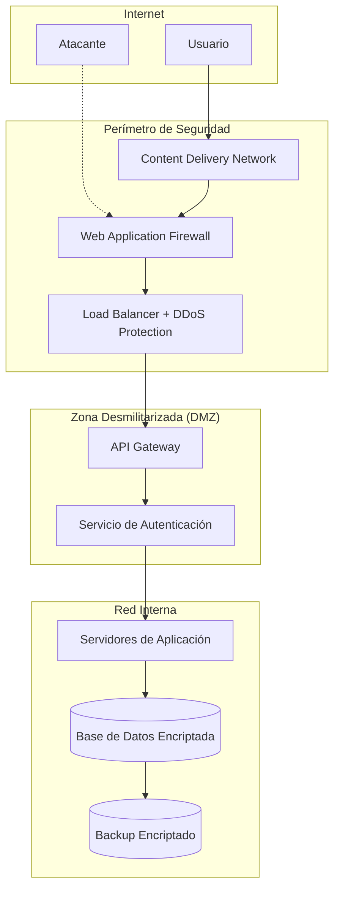
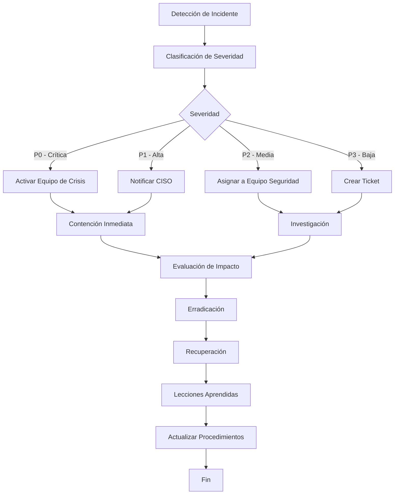
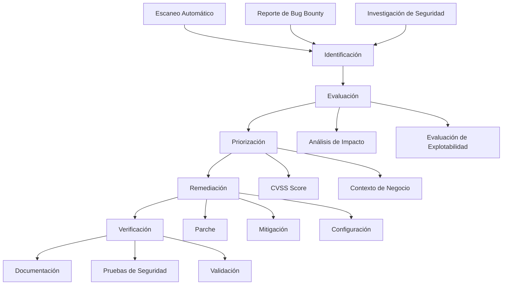
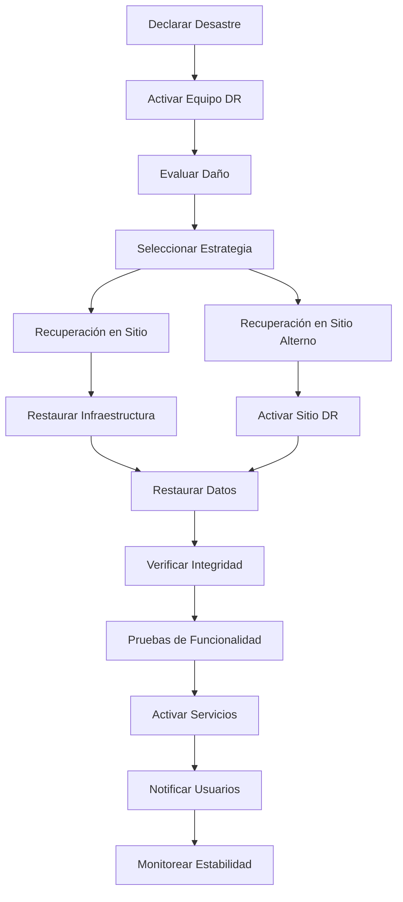

# Procedimientos de Seguridad - NeuralHack Cognitive AI

## Resumen Ejecutivo

Este documento establece los procedimientos de seguridad implementados en NeuralHack Cognitive AI para proteger datos médicos sensibles y cumplir con regulaciones internacionales de privacidad y seguridad de datos de salud.

## Marco de Seguridad

### Principios de Seguridad por Diseño

1. **Defensa en Profundidad**: Múltiples capas de seguridad
2. **Principio de Menor Privilegio**: Acceso mínimo necesario
3. **Separación de Responsabilidades**: Segregación de funciones críticas
4. **Transparencia**: Auditoría completa de todas las operaciones
5. **Privacidad por Diseño**: Protección de datos desde el desarrollo

### Clasificación de Datos

#### Datos Altamente Sensibles (Nivel 4)
- **Contenido**: Resultados de evaluaciones cognitivas, diagnósticos
- **Protección**: Encriptación AES-256, acceso restringido
- **Retención**: Según regulaciones médicas (mínimo 7 años)
- **Acceso**: Solo personal autorizado con justificación médica

#### Datos Sensibles (Nivel 3)
- **Contenido**: Información personal identificable (PII)
- **Protección**: Encriptación AES-256, tokenización
- **Retención**: Según consentimiento del usuario
- **Acceso**: Personal técnico autorizado para soporte

#### Datos Internos (Nivel 2)
- **Contenido**: Logs de aplicación, métricas de rendimiento
- **Protección**: Encriptación en tránsito, acceso controlado
- **Retención**: 90 días para logs operacionales
- **Acceso**: Equipo de desarrollo y operaciones

#### Datos Públicos (Nivel 1)
- **Contenido**: Documentación pública, contenido educativo
- **Protección**: Integridad y disponibilidad
- **Retención**: Indefinida
- **Acceso**: Público general

## Arquitectura de Seguridad

### Seguridad de Red

#### Perímetro de Red


#### Configuración de Firewall
- **Reglas de Entrada**: Solo puertos 80 (HTTP) y 443 (HTTPS)
- **Reglas de Salida**: Restricciones por servicio y destino
- **Geo-blocking**: Bloqueo de países de alto riesgo
- **Rate Limiting**: Límites por IP y usuario

#### Protección DDoS
- **Detección Automática**: Patrones de tráfico anómalos
- **Mitigación**: Filtrado de tráfico malicioso
- **Escalado Automático**: Recursos adicionales bajo ataque
- **Notificación**: Alertas inmediatas al equipo de seguridad

### Seguridad de Aplicación

#### Autenticación Multifactor (MFA)

##### Factores de Autenticación
1. **Algo que sabes**: Contraseña
2. **Algo que tienes**: Dispositivo móvil (SMS/App)
3. **Algo que eres**: Biometría (futuro)

##### Implementación MFA
```typescript
interface MFAConfiguration {
  primaryFactor: 'password' | 'biometric'
  secondaryFactor: 'sms' | 'totp' | 'push'
  backupCodes: string[]
  gracePeriod: number // días
  enforcementPolicy: 'optional' | 'required' | 'risk_based'
}

class MFAService {
  async enableMFA(userId: string, config: MFAConfiguration): Promise<void> {
    // Validar configuración
    await this.validateMFAConfig(config)
    
    // Generar códigos de backup
    const backupCodes = this.generateBackupCodes()
    
    // Almacenar configuración encriptada
    await this.storeMFAConfig(userId, {
      ...config,
      backupCodes: this.encryptBackupCodes(backupCodes)
    })
    
    // Auditar activación
    await this.auditLog('mfa_enabled', userId)
  }
  
  async verifyMFA(userId: string, token: string): Promise<boolean> {
    const config = await this.getMFAConfig(userId)
    
    switch (config.secondaryFactor) {
      case 'sms':
        return this.verifySMSToken(userId, token)
      case 'totp':
        return this.verifyTOTPToken(userId, token)
      case 'push':
        return this.verifyPushToken(userId, token)
      default:
        throw new Error('Unsupported MFA method')
    }
  }
}
```

#### Gestión de Sesiones

##### Configuración de Sesiones
- **Duración**: 15 minutos para tokens de acceso
- **Refresh**: 7 días para tokens de actualización
- **Rotación**: Automática en cada uso
- **Revocación**: Inmediata en logout o sospecha

##### Implementación de Sesiones Seguras
```typescript
interface SessionConfiguration {
  accessTokenTTL: number // 15 minutos
  refreshTokenTTL: number // 7 días
  maxConcurrentSessions: number // 3 dispositivos
  sessionTimeout: number // 30 minutos inactividad
  secureFlags: {
    httpOnly: boolean
    secure: boolean
    sameSite: 'strict' | 'lax' | 'none'
  }
}

class SessionManager {
  async createSession(userId: string, deviceInfo: DeviceInfo): Promise<Session> {
    // Verificar límite de sesiones concurrentes
    await this.enforceSessionLimit(userId)
    
    // Generar tokens seguros
    const accessToken = this.generateJWT(userId, '15m')
    const refreshToken = this.generateSecureToken()
    
    // Almacenar sesión
    const session = await this.storeSession({
      userId,
      accessToken: this.hashToken(accessToken),
      refreshToken: this.hashToken(refreshToken),
      deviceInfo,
      createdAt: new Date(),
      lastActivity: new Date()
    })
    
    // Auditar creación de sesión
    await this.auditLog('session_created', userId, { deviceInfo })
    
    return session
  }
  
  async validateSession(token: string): Promise<Session | null> {
    try {
      // Verificar y decodificar JWT
      const payload = this.verifyJWT(token)
      
      // Buscar sesión activa
      const session = await this.findActiveSession(payload.userId, token)
      
      if (!session) {
        await this.auditLog('invalid_session', payload.userId)
        return null
      }
      
      // Actualizar última actividad
      await this.updateLastActivity(session.id)
      
      return session
    } catch (error) {
      await this.auditLog('session_validation_failed', null, { error: error.message })
      return null
    }
  }
}
```

### Encriptación de Datos

#### Encriptación en Tránsito

##### Configuración TLS
- **Versión**: TLS 1.3 mínimo
- **Cipher Suites**: Solo algoritmos seguros (AEAD)
- **Certificate Pinning**: Validación de certificados
- **HSTS**: HTTP Strict Transport Security habilitado

##### Implementación Certificate Pinning
```typescript
class CertificatePinning {
  private pinnedCertificates: Map<string, string[]> = new Map([
    ['api.neuralhack.com', [
      'sha256/AAAAAAAAAAAAAAAAAAAAAAAAAAAAAAAAAAAAAAAAAAA=',
      'sha256/BBBBBBBBBBBBBBBBBBBBBBBBBBBBBBBBBBBBBBBBBBB='
    ]]
  ])
  
  async validateCertificate(hostname: string, certificate: string): Promise<boolean> {
    const pinnedHashes = this.pinnedCertificates.get(hostname)
    
    if (!pinnedHashes) {
      throw new Error(`No pinned certificates for ${hostname}`)
    }
    
    const certificateHash = this.calculateSHA256(certificate)
    
    if (!pinnedHashes.includes(certificateHash)) {
      await this.auditLog('certificate_pinning_failed', null, { hostname, hash: certificateHash })
      throw new Error('Certificate pinning validation failed')
    }
    
    return true
  }
}
```

#### Encriptación en Reposo

##### Configuración AES-256
- **Algoritmo**: AES-256-GCM
- **Gestión de Claves**: AWS KMS / Azure Key Vault
- **Rotación**: Automática cada 90 días
- **Backup**: Claves almacenadas en múltiples regiones

##### Implementación de Encriptación
```typescript
class EncryptionService {
  private keyManagement: KeyManagementService
  
  constructor(keyManagement: KeyManagementService) {
    this.keyManagement = keyManagement
  }
  
  async encryptPII(data: any, userId: string): Promise<EncryptedData> {
    // Obtener clave de encriptación del usuario
    const dataKey = await this.keyManagement.getDataKey(userId)
    
    // Serializar datos
    const plaintext = JSON.stringify(data)
    
    // Generar IV aleatorio
    const iv = crypto.randomBytes(12)
    
    // Encriptar con AES-256-GCM
    const cipher = crypto.createCipher('aes-256-gcm', dataKey)
    cipher.setAAD(Buffer.from(userId))
    
    let encrypted = cipher.update(plaintext, 'utf8', 'hex')
    encrypted += cipher.final('hex')
    
    const authTag = cipher.getAuthTag()
    
    return {
      encryptedData: encrypted,
      iv: iv.toString('hex'),
      authTag: authTag.toString('hex'),
      algorithm: 'aes-256-gcm',
      keyId: dataKey.keyId
    }
  }
  
  async decryptPII(encryptedData: EncryptedData, userId: string): Promise<any> {
    // Obtener clave de desencriptación
    const dataKey = await this.keyManagement.getDataKey(userId, encryptedData.keyId)
    
    // Configurar decipher
    const decipher = crypto.createDecipher('aes-256-gcm', dataKey)
    decipher.setAAD(Buffer.from(userId))
    decipher.setAuthTag(Buffer.from(encryptedData.authTag, 'hex'))
    
    // Desencriptar
    let decrypted = decipher.update(encryptedData.encryptedData, 'hex', 'utf8')
    decrypted += decipher.final('utf8')
    
    return JSON.parse(decrypted)
  }
}
```

## Procedimientos Operacionales

### Gestión de Incidentes de Seguridad

#### Clasificación de Incidentes

##### Severidad Crítica (P0)
- **Definición**: Brecha de datos médicos, acceso no autorizado masivo
- **Tiempo de Respuesta**: 15 minutos
- **Escalación**: CISO, CEO, equipo legal
- **Notificación**: Autoridades regulatorias en 72 horas

##### Severidad Alta (P1)
- **Definición**: Vulnerabilidad crítica, intento de acceso no autorizado
- **Tiempo de Respuesta**: 1 hora
- **Escalación**: CISO, equipo de seguridad
- **Notificación**: Usuarios afectados en 24 horas

##### Severidad Media (P2)
- **Definición**: Vulnerabilidad moderada, anomalía de seguridad
- **Tiempo de Respuesta**: 4 horas
- **Escalación**: Equipo de seguridad
- **Notificación**: Reporte interno

##### Severidad Baja (P3)
- **Definición**: Vulnerabilidad menor, mejora de seguridad
- **Tiempo de Respuesta**: 24 horas
- **Escalación**: Equipo técnico
- **Notificación**: Reporte semanal

#### Proceso de Respuesta a Incidentes



#### Equipo de Respuesta a Incidentes (IRT)

##### Roles y Responsabilidades
- **Incident Commander**: Coordinación general, comunicación externa
- **Security Analyst**: Investigación técnica, análisis forense
- **System Administrator**: Contención, recuperación de sistemas
- **Legal Counsel**: Aspectos legales, notificaciones regulatorias
- **Communications**: Comunicación interna y externa
- **Business Continuity**: Continuidad del negocio

##### Procedimientos de Comunicación
```typescript
interface IncidentCommunication {
  severity: 'P0' | 'P1' | 'P2' | 'P3'
  stakeholders: {
    internal: string[]
    external: string[]
    regulatory: string[]
  }
  templates: {
    initial: string
    update: string
    resolution: string
  }
  channels: {
    email: boolean
    sms: boolean
    slack: boolean
    phone: boolean
  }
}

class IncidentCommunicationManager {
  async notifyStakeholders(incident: SecurityIncident): Promise<void> {
    const config = this.getCommunicationConfig(incident.severity)
    
    // Notificación inicial
    await this.sendInitialNotification(incident, config)
    
    // Programar actualizaciones regulares
    await this.scheduleUpdates(incident, config)
    
    // Notificar autoridades si es requerido
    if (this.requiresRegulatoryNotification(incident)) {
      await this.notifyRegulators(incident)
    }
  }
  
  private async notifyRegulators(incident: SecurityIncident): Promise<void> {
    const notifications = [
      {
        authority: 'COFEPRIS',
        deadline: '72 hours',
        method: 'official_portal'
      },
      {
        authority: 'INAI',
        deadline: '72 hours',
        method: 'email'
      }
    ]
    
    for (const notification of notifications) {
      await this.sendRegulatoryNotification(incident, notification)
    }
  }
}
```

### Auditoría y Monitoreo

#### Logging de Seguridad

##### Eventos Auditados
- **Autenticación**: Login, logout, fallos de autenticación
- **Autorización**: Acceso a recursos, cambios de permisos
- **Datos Médicos**: Acceso, modificación, exportación
- **Configuración**: Cambios en configuración de seguridad
- **Sistema**: Errores, excepciones, anomalías

##### Formato de Logs de Auditoría
```json
{
  "timestamp": "2024-12-08T10:00:00.000Z",
  "eventId": "uuid",
  "eventType": "data_access",
  "severity": "info",
  "userId": "user_uuid",
  "sessionId": "session_uuid",
  "sourceIP": "192.168.1.100",
  "userAgent": "Mozilla/5.0...",
  "resource": "/api/v1/assessments/results",
  "action": "read",
  "result": "success",
  "metadata": {
    "assessmentId": "assessment_uuid",
    "dataClassification": "highly_sensitive",
    "justification": "medical_consultation"
  },
  "hash": "sha256_hash_for_integrity"
}
```

#### Monitoreo en Tiempo Real

##### Métricas de Seguridad
- **Intentos de Autenticación Fallidos**: >5 por minuto por IP
- **Accesos Anómalos**: Fuera de horarios habituales
- **Volumen de Datos**: Exportaciones masivas inusuales
- **Geolocalización**: Accesos desde ubicaciones inusuales
- **Patrones de Uso**: Comportamiento anómalo de usuarios

##### Sistema de Alertas
```typescript
interface SecurityAlert {
  id: string
  type: 'authentication' | 'data_access' | 'system' | 'network'
  severity: 'low' | 'medium' | 'high' | 'critical'
  title: string
  description: string
  indicators: {
    source: string
    value: any
    threshold: any
  }[]
  recommendedActions: string[]
  autoRemediation?: {
    enabled: boolean
    actions: string[]
  }
}

class SecurityMonitoring {
  private alertRules: AlertRule[] = []
  
  async evaluateSecurityMetrics(): Promise<void> {
    const metrics = await this.collectSecurityMetrics()
    
    for (const rule of this.alertRules) {
      const violations = await this.evaluateRule(rule, metrics)
      
      for (const violation of violations) {
        const alert = await this.createAlert(rule, violation)
        await this.processAlert(alert)
      }
    }
  }
  
  private async processAlert(alert: SecurityAlert): Promise<void> {
    // Registrar alerta
    await this.logAlert(alert)
    
    // Notificar equipo de seguridad
    await this.notifySecurityTeam(alert)
    
    // Ejecutar remediación automática si está habilitada
    if (alert.autoRemediation?.enabled) {
      await this.executeAutoRemediation(alert)
    }
    
    // Crear ticket de seguimiento
    await this.createSecurityTicket(alert)
  }
}
```

### Gestión de Vulnerabilidades

#### Proceso de Gestión de Vulnerabilidades



#### Clasificación de Vulnerabilidades

##### Sistema CVSS v3.1
- **Crítica (9.0-10.0)**: Remediación inmediata (24 horas)
- **Alta (7.0-8.9)**: Remediación urgente (7 días)
- **Media (4.0-6.9)**: Remediación programada (30 días)
- **Baja (0.1-3.9)**: Remediación planificada (90 días)

##### Factores de Priorización
```typescript
interface VulnerabilityAssessment {
  cvssScore: number
  exploitability: 'none' | 'poc' | 'functional' | 'high'
  dataExposure: 'none' | 'limited' | 'significant' | 'complete'
  systemCriticality: 'low' | 'medium' | 'high' | 'critical'
  publicDisclosure: boolean
  activeExploitation: boolean
  compensatingControls: string[]
  businessImpact: 'low' | 'medium' | 'high' | 'critical'
}

class VulnerabilityManager {
  calculatePriority(vuln: VulnerabilityAssessment): 'P0' | 'P1' | 'P2' | 'P3' {
    let score = vuln.cvssScore
    
    // Ajustes por contexto
    if (vuln.activeExploitation) score += 2
    if (vuln.publicDisclosure) score += 1
    if (vuln.dataExposure === 'complete') score += 1.5
    if (vuln.systemCriticality === 'critical') score += 1
    
    // Reducción por controles compensatorios
    if (vuln.compensatingControls.length > 0) score -= 0.5
    
    if (score >= 9) return 'P0'
    if (score >= 7) return 'P1'
    if (score >= 4) return 'P2'
    return 'P3'
  }
}
```

## Cumplimiento Regulatorio

### GDPR (Reglamento General de Protección de Datos)

#### Medidas Técnicas y Organizativas

##### Artículo 32 - Seguridad del Tratamiento
- **Pseudonimización y Encriptación**: Implementado con AES-256
- **Confidencialidad**: Control de acceso basado en roles
- **Integridad**: Checksums y firmas digitales
- **Disponibilidad**: Backup y recuperación de desastres
- **Resiliencia**: Arquitectura distribuida y redundante

##### Implementación de Derechos del Interesado
```typescript
class GDPRComplianceService {
  // Derecho de Acceso (Artículo 15)
  async exportUserData(userId: string): Promise<UserDataExport> {
    const userData = await this.collectAllUserData(userId)
    
    return {
      personalData: await this.decryptPII(userData.personalData),
      assessmentResults: userData.assessmentResults,
      processingActivities: userData.processingLog,
      dataRetention: userData.retentionSchedule,
      thirdPartySharing: userData.sharingLog,
      exportDate: new Date(),
      format: 'structured_json'
    }
  }
  
  // Derecho de Rectificación (Artículo 16)
  async rectifyUserData(userId: string, corrections: DataCorrections): Promise<void> {
    // Validar correcciones
    await this.validateCorrections(corrections)
    
    // Aplicar correcciones
    await this.applyDataCorrections(userId, corrections)
    
    // Auditar cambios
    await this.auditDataRectification(userId, corrections)
    
    // Notificar a terceros si es necesario
    await this.notifyThirdParties(userId, corrections)
  }
  
  // Derecho al Olvido (Artículo 17)
  async eraseUserData(userId: string, reason: ErasureReason): Promise<void> {
    // Verificar legitimidad de la solicitud
    await this.validateErasureRequest(userId, reason)
    
    // Anonimizar datos para investigación
    await this.anonymizeResearchData(userId)
    
    // Eliminar datos personales
    await this.deletePersonalData(userId)
    
    // Notificar a terceros
    await this.notifyThirdPartiesOfErasure(userId)
    
    // Auditar eliminación
    await this.auditDataErasure(userId, reason)
  }
}
```

### HIPAA (Health Insurance Portability and Accountability Act)

#### Salvaguardas Administrativas
- **Oficial de Seguridad**: CISO designado
- **Capacitación**: Programa anual de concientización
- **Contingencia**: Plan de continuidad del negocio
- **Evaluación**: Auditorías anuales de seguridad

#### Salvaguardas Físicas
- **Controles de Acceso**: Centros de datos seguros
- **Estaciones de Trabajo**: Configuración segura
- **Medios**: Controles de almacenamiento y eliminación

#### Salvaguardas Técnicas
- **Control de Acceso**: Autenticación y autorización
- **Auditoría**: Logs completos de acceso
- **Integridad**: Protección contra alteración
- **Transmisión**: Encriptación en tránsito

### LFTIDPI (Ley Federal de Transparencia y Acceso a la Información Pública)

#### Principios de Protección de Datos
- **Licitud**: Tratamiento conforme a la ley
- **Consentimiento**: Autorización expresa del titular
- **Información**: Transparencia en el tratamiento
- **Calidad**: Datos exactos y actualizados
- **Finalidad**: Uso conforme al propósito declarado
- **Lealtad**: Tratamiento conforme a expectativas
- **Proporcionalidad**: Datos necesarios y relevantes
- **Responsabilidad**: Demostrar cumplimiento

## Procedimientos de Backup y Recuperación

### Estrategia de Backup

#### Regla 3-2-1
- **3 Copias**: Original + 2 backups
- **2 Medios**: Diferentes tecnologías de almacenamiento
- **1 Offsite**: Copia en ubicación geográfica diferente

#### Tipos de Backup
- **Completo**: Todos los datos (semanal)
- **Incremental**: Solo cambios (diario)
- **Diferencial**: Cambios desde último completo (cada 6 horas)
- **Snapshot**: Estado punto en tiempo (cada hora)

#### Implementación de Backup
```typescript
interface BackupConfiguration {
  schedule: {
    full: string // "0 2 * * 0" (Domingos 2 AM)
    incremental: string // "0 2 * * 1-6" (Lunes-Sábado 2 AM)
    differential: string // "0 */6 * * *" (Cada 6 horas)
    snapshot: string // "0 * * * *" (Cada hora)
  }
  retention: {
    daily: number // 30 días
    weekly: number // 12 semanas
    monthly: number // 12 meses
    yearly: number // 7 años
  }
  encryption: {
    algorithm: 'AES-256-GCM'
    keyRotation: number // 90 días
  }
  verification: {
    integrity: boolean
    restoration: boolean
    frequency: string // "0 4 * * 1" (Lunes 4 AM)
  }
}

class BackupService {
  async performBackup(type: BackupType): Promise<BackupResult> {
    const startTime = new Date()
    
    try {
      // Crear snapshot consistente
      const snapshot = await this.createConsistentSnapshot()
      
      // Encriptar datos
      const encryptedData = await this.encryptBackupData(snapshot)
      
      // Transferir a almacenamiento
      const location = await this.transferToStorage(encryptedData, type)
      
      // Verificar integridad
      await this.verifyBackupIntegrity(location)
      
      // Registrar éxito
      const result = {
        id: this.generateBackupId(),
        type,
        startTime,
        endTime: new Date(),
        size: encryptedData.length,
        location,
        checksum: this.calculateChecksum(encryptedData),
        status: 'success'
      }
      
      await this.logBackupResult(result)
      return result
      
    } catch (error) {
      await this.handleBackupFailure(error, type, startTime)
      throw error
    }
  }
  
  async verifyBackupIntegrity(location: string): Promise<boolean> {
    // Verificar checksum
    const storedChecksum = await this.getStoredChecksum(location)
    const calculatedChecksum = await this.calculateStoredChecksum(location)
    
    if (storedChecksum !== calculatedChecksum) {
      throw new Error('Backup integrity verification failed')
    }
    
    // Verificar capacidad de restauración (muestra)
    await this.performSampleRestoration(location)
    
    return true
  }
}
```

### Procedimientos de Recuperación

#### Objetivos de Recuperación
- **RTO (Recovery Time Objective)**: 4 horas máximo
- **RPO (Recovery Point Objective)**: 1 hora máximo
- **MTTR (Mean Time To Recovery)**: 2 horas promedio

#### Escenarios de Recuperación

##### Recuperación de Datos Individuales
```typescript
class DataRecoveryService {
  async recoverUserData(userId: string, pointInTime: Date): Promise<void> {
    // Identificar backup apropiado
    const backup = await this.findBackupForPointInTime(pointInTime)
    
    // Extraer datos del usuario
    const userData = await this.extractUserDataFromBackup(backup, userId)
    
    // Validar integridad de datos
    await this.validateDataIntegrity(userData)
    
    // Restaurar datos
    await this.restoreUserData(userId, userData)
    
    // Auditar recuperación
    await this.auditDataRecovery(userId, pointInTime, backup.id)
  }
}
```

##### Recuperación de Sistema Completo


## Capacitación y Concientización

### Programa de Capacitación en Seguridad

#### Capacitación Obligatoria
- **Frecuencia**: Anual para todos los empleados
- **Contenido**: Políticas de seguridad, manejo de datos médicos
- **Evaluación**: Examen con 80% mínimo de aprobación
- **Certificación**: Certificado de finalización requerido

#### Capacitación Especializada
- **Desarrolladores**: Secure coding, OWASP Top 10
- **Administradores**: Hardening de sistemas, gestión de logs
- **Soporte**: Manejo de incidentes, escalación
- **Gerencia**: Gestión de riesgos, cumplimiento regulatorio

#### Simulacros de Seguridad
```typescript
interface SecurityDrill {
  type: 'phishing' | 'social_engineering' | 'incident_response' | 'data_breach'
  frequency: 'monthly' | 'quarterly' | 'annually'
  participants: string[]
  scenarios: DrillScenario[]
  metrics: {
    responseTime: number
    correctActions: number
    improvementAreas: string[]
  }
}

class SecurityTrainingService {
  async conductPhishingDrill(): Promise<DrillResult> {
    // Enviar emails de phishing simulados
    const targets = await this.selectRandomEmployees(0.3) // 30% de empleados
    const phishingEmails = await this.sendSimulatedPhishing(targets)
    
    // Monitorear respuestas
    const responses = await this.monitorResponses(phishingEmails, '24h')
    
    // Analizar resultados
    const analysis = this.analyzePhishingResults(responses)
    
    // Proporcionar capacitación adicional a quienes fallaron
    await this.scheduleAdditionalTraining(analysis.failedUsers)
    
    return {
      totalTargets: targets.length,
      clickedLink: analysis.clickedCount,
      reportedPhishing: analysis.reportedCount,
      successRate: analysis.successRate,
      improvementNeeded: analysis.failedUsers
    }
  }
}
```

---

**Documento**: Procedimientos de Seguridad v1.0  
**Fecha**: Diciembre 2024  
**Autor**: Equipo de Seguridad NeuralHack  
**Revisión**: Pendiente  
**Próxima Actualización**: Enero 2025

## Apéndices

### Apéndice A: Matriz de Riesgos de Seguridad
### Apéndice B: Procedimientos de Escalación
### Apéndice C: Contactos de Emergencia
### Apéndice D: Plantillas de Comunicación de Incidentes
### Apéndice E: Checklist de Auditoría de Seguridad