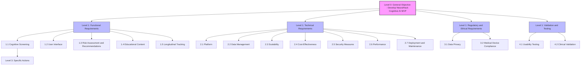

# NeuralHack Cognitive AI: Requirements Decision Tree

## Executive Summary
NeuralHack Cognitive AI is a mobile-first Progressive Web App (PWA) designed to provide early screening for neurodegenerative diseases (e.g., Alzheimer's, Parkinson's, dementia) and depression, targeting underserved communities in Mexico. The Minimum Viable Product (MVP) integrates validated cognitive tests such as the Montreal Cognitive Assessment (MoCA), Patient Health Questionnaire-9 (PHQ-9), Mini-Mental State Examination (MMSE), Alzheimer's Disease 8 (AD8), and a Parkinson's screening questionnaire. It uses a rule-based system to map scores to risk percentages (0–100%), displayed in an accessible dashboard with actionable recommendations. Built with open-source tools (React, Node.js, PostgreSQL) and hosted on Supabase free tier, the MVP ensures zero initial investment. It complies with Mexico’s COFEPRIS regulations for Software as a Medical Device (SaMD) and data privacy laws (GDPR, HIPAA, LFTIDPI). Future iterations will incorporate machine learning models like logistic regression for enhanced predictive accuracy. The app aligns with the telehealth market, projected to reach USD 286.22 billion by 2025 (Towards Healthcare), and the dementia-specific app market, growing at 4.8% annually (Cognitive Market Research).

## Requirements Decision Tree Overview
The requirements are organized hierarchically as a decision tree, starting from the general objective and branching into categories, sub-requirements, and specific actions. This structure ensures a comprehensive, scalable, and ethical development process for the MVP.

### Decision Tree Diagram

## Level 0: General Objective
- **Develop NeuralHack Cognitive AI MVP for early screening of neurodegenerative diseases and depression**

## Level 1: Main Requirement Categories
1. **Functional Requirements**
2. **Technical Requirements**
3. **Regulatory and Ethical Requirements**
4. **Validation and Testing**

## Level 2: Sub-Requirements

### 1. Functional Requirements

#### 1.1 Cognitive Screening
- 1.1.1 Implement validated cognitive tests (e.g., MoCA, PHQ-9, MMSE, AD8, Parkinson’s questionnaire)
- 1.1.2 Ensure accurate scoring and risk mapping based on literature-derived cutoffs
- 1.1.3 Validate tests for the target demographic (e.g., Spanish-speaking older adults in Mexico)

#### 1.2 User Interface
- 1.2.1 Include accessibility features (e.g., large fonts, high contrast, voice guidance)
- 1.2.2 Provide multilingual support (e.g., Spanish/English)
- 1.2.3 Ensure culturally appropriate design and content

#### 1.3 Risk Assessment and Recommendations
- 1.3.1 Define risk categories (e.g., low: 0–5%, moderate: 5–40%, high: >40%) based on test scores
- 1.3.2 Provide tailored recommendations (e.g., lifestyle changes, specialist consultation)

#### 1.4 Educational Content
- 1.4.1 Include information on neurodegenerative diseases and preventive lifestyle measures

#### 1.5 Longitudinal Tracking
- 1.5.1 Allow users to retake tests and track changes over time
- 1.5.2 Provide trend analysis or alerts for significant changes

### 2. Technical Requirements

#### 2.1 Platform
- 2.1.1 Use a Progressive Web App (PWA) for cross-platform compatibility and offline functionality

#### 2.2 Data Management
- 2.2.1 Ensure secure storage with end-to-end encryption
- 2.2.2 Implement user consent mechanisms and data anonymization
- 2.2.3 Plan for using anonymized data for future research and model training

#### 2.3 Scalability
- 2.3.1 Design a modular architecture to allow for future machine learning integration

#### 2.4 Cost-Effectiveness
- 2.4.1 Use open-source tools (e.g., React, Node.js, PostgreSQL) and free hosting (e.g., AWS Free Tier)

#### 2.5 Security Measures
- 2.5.1 Implement user authentication and authorization
- 2.5.2 Conduct regular security audits and updates

#### 2.6 Performance
- 2.6.1 Optimize for speed and reliability, especially for offline use

#### 2.7 Deployment and Maintenance
- 2.7.1 Use CI/CD pipelines for automated testing and deployment
- 2.7.2 Plan for regular updates and bug fixes

### 3. Regulatory and Ethical Requirements

#### 3.1 Data Privacy
- 3.1.1 Comply with GDPR, HIPAA, and Mexico’s LFTIDPI
- 3.1.2 Implement user rights (e.g., access, correction, deletion of data)

#### 3.2 Medical Device Compliance
- 3.2.1 Register with COFEPRIS as Software as a Medical Device (SaMD)
- 3.2.2 Conduct clinical validation studies to meet regulatory standards

### 4. Validation and Testing

#### 4.1 Usability Testing
- 4.1.1 Conduct pilot studies with the target demographic (e.g., adults >50 years)

#### 4.2 Clinical Validation
- 4.2.1 Measure sensitivity and specificity of risk assessments
- 4.2.2 Collaborate with clinical partners (e.g., UNAM, IPN, Alzheimer’s associations)

## Level 3: Specific Actions or Considerations

### 1.1.1 Implement Validated Tests
- Research and select tests based on clinical validity and minimal licensing costs
- Develop digital versions ensuring fidelity to original test protocols
- Integrate tests with clear instructions and timers

### 1.1.2 Accurate Scoring and Risk Mapping
- Automate scoring using predefined rules (e.g., MoCA: <26 indicates MCI)
- Adjust scores for demographic factors (e.g., education level)
- Map scores to risk percentages using literature-based cutoffs

### 1.1.3 Validate for Target Demographic
- Ensure tests are culturally and linguistically appropriate for Spanish-speaking users
- Pilot test with Mexican older adults to confirm applicability

### 1.2.1 Accessibility Features
- Use large, readable fonts and high-contrast color schemes
- Implement voice guidance for users with visual or motor impairments
- Simplify navigation for ease of use

### 1.2.2 Multilingual Support
- Provide Spanish language options
- Ensure translations are accurate and culturally relevant

### 1.2.3 Culturally Appropriate Design
- Use imagery and examples relevant to Mexican culture
- Avoid cultural biases in test content

### 1.3.1 Define Risk Categories
- Use validated cutoffs (e.g., PHQ-9: 10–14 for moderate depression)
- Assign probabilities (e.g., 0–5% low, 5–40% moderate, >40% high)

### 1.3.2 Provide Tailored Recommendations
- Suggest lifestyle changes (e.g., Mediterranean diet, exercise) for low/moderate risk
- Recommend specialist consultation for high risk

### 1.4.1 Educational Content
- Include articles on disease prevention (e.g., sleep, diet)
- Provide links to reputable resources (e.g., Alzheimer’s Association)

### 1.5.1 Longitudinal Tracking
- Store test results securely for repeat testing
- Allow users to schedule reminders for retesting

### 1.5.2 Trend Analysis
- Display score trends in a user-friendly dashboard
- Alert users to significant declines in scores

### 2.1.1 Use PWA
- Develop with React and Ionic for cross-platform compatibility
- Ensure offline functionality using service workers

### 2.2 Test Development
- **Test Selection**: Chosen for clinical validity, availability, and minimal licensing costs:
  - MoCA: Assesses memory, attention, language, and executive function (sensitivity 90% for MCI) [MoCA Website](https://mocacognition.com/).
  - PHQ-9: Screens for depression severity [PsychDB](https://www.psychdb.com/geri/2-depression/phq-9).
  - MMSE: General cognitive screening [PsychDB](https://www.psychdb.com/cognitive-testing/mmse).
  - AD8: Early Alzheimer’s detection [Alzheimer’s Association](https://www.alz.org/getmedia/9687d51e-641a-43a1-a96b-b29eb00e72bb/cognitive-assessment-toolkit).
  - Parkinson’s Questionnaire: Based on validated symptoms (e.g., Michael J. Fox Foundation).
- **Digital Implementation**:
  - Convert paper-based tests into interactive digital formats.
  - Ensure accurate administration with clear instructions and timers.
  - Support offline functionality for rural users.
- **Scoring**:
  - Automate scoring using predefined rules (e.g., MoCA: 0–30, <26 indicates MCI).
  - Adjust scores for education level (e.g., add 1 point for ≤12 years of education in MoCA).

### 2.2.1 Secure Storage
- Use PostgreSQL with encryption for data at rest
- Implement HTTPS for data in transit

### 2.2.2 User Consent
- Require explicit consent for data collection and usage
- Provide clear privacy policy and opt-out options

### 2.2.3 Anonymized Data
- Plan for anonymized data storage for future ML training
- Ensure compliance with ethical research standards

### 2.3 Risk Mapping
The MVP uses a rule-based system to map test scores to risk percentages for each condition, based on literature-derived cutoffs:

| Test         | Score Range | Risk Category     | Probability | Recommendation                                      |
|--------------|-------------|-------------------|-------------|-----------------------------------------------------|
| MoCA        | 26–30      | Low              | 0–5%       | Monitor cognitive health, adopt healthy lifestyle.  |
|             | 18–25      | Moderate         | 5–40%      | Regular monitoring, lifestyle changes, consider specialist consultation. |
|             | <18        | High             | >40%       | Consult a neurospecialist, consider neuroimaging.   |
| PHQ-9       | 0–4        | None             | 0–5%       | Maintain mental health practices.                   |
|             | 5–9        | Mild             | 5–20%      | Monitor symptoms, engage in stress management.      |
|             | 10–14      | Moderate         | 20–50%     | Consult a mental health professional.               |
|             | 15–19      | Moderately Severe| 50–80%     | Seek immediate specialist care.                     |
|             | 20–27      | Severe           | >80%       | Urgent specialist referral.                         |
| MMSE        | 24–30      | Low              | 0–5%       | Monitor cognitive health.                           |
|             | 18–23      | Moderate         | 5–40%      | Regular monitoring, lifestyle changes.               |
|             | <18        | High             | >40%       | Specialist consultation, neuroimaging.               |
| AD8         | 0–1        | Low              | 0–5%       | Continue healthy practices.                         |
|             | 2–4        | Moderate         | 5–40%      | Monitor, consider specialist evaluation.            |
|             | 5–8        | High             | >40%       | Specialist referral.                                |
| Parkinson’s | Based on validated questionnaire cutoffs | Low/Moderate/High | 0–5%/5–40%/>40% | Tailored based on symptom severity.                 |

### 2.3.1 Modular Architecture
- Design APIs to integrate future ML models (e.g., logistic regression)
- Use RESTful APIs for scalability

### 2.4 Dashboard
- **Display**: Test scores, risk percentages, and visualizations (e.g., progress bars, pie charts).
- **Recommendations**: Tailored advice based on risk levels (e.g., “Visit a neurospecialist” for high risk).
- **Accessibility**: Large fonts, high-contrast colors, voice guidance, Spanish/English toggle.
- **Table with Results**: Include a table showing past test results and the current one, stored and compared to previous ones to track progression and trigger alerts. Files are downloadable only by the patient for sharing with doctors, including voice recordings and drawings. Data is encrypted and anonymized for admins; patients can view history, profile, data, consents, privacy, and settings upon sign-in. Sharing via WhatsApp or email is supported.

| Feature                  | Description                                                                 |
|--------------------------|-----------------------------------------------------------------------------|
| Results Table            | Columns: Test Date, Test Type, Score, Risk Level, Progression Change (%)   |
| Download Options         | PDF/CSV export with encryption; patient-only access                        |
| Sharing                  | Integrated buttons for WhatsApp/Email; secure links                        |
| Progression Alerts       | Notifications for significant declines (e.g., >10% drop)                   |
| Data Privacy             | Encrypted storage; anonymized for non-patient views                        |

### 2.4.1 Open-Source Tools
- Use React for frontend, Node.js/Django for backend
- Host on AWS Free Tier or GitHub Pages

### 2.5.1 Authentication
- Implement OAuth or JWT for secure user access
- Use role-based access control

### 2.5.2 Security Audits
- Schedule regular vulnerability scans
- Update dependencies to patch security flaws

### 2.6.1 Performance Optimization
- Minimize app size for fast loading
- Optimize database queries for efficiency

### 2.7.1 CI/CD Pipelines
- Use GitHub Actions for automated testing and deployment
- Implement unit and integration tests

### 2.7.2 Regular Updates
- Plan for monthly bug fixes and feature updates
- Monitor user feedback for improvements

### 3.1.1 Data Privacy Compliance
- Encrypt data using AES-256
- Comply with Mexico’s LFTIDPI for local users

### 3.1.2 User Rights
- Allow users to view, edit, or delete their data
- Provide data export functionality

### 3.2.1 COFEPRIS Registration
- Prepare documentation for SaMD classification
- Submit for regulatory review

### 3.2.2 Clinical Validation Studies
- Design studies to meet COFEPRIS requirements
- Partner with universities for study execution

### 4.1.1 Usability Testing
- Conduct pilot with 20–50 users (>50 years)
- Collect feedback on interface and accessibility

### 4.2.1 Sensitivity and Specificity
- Compare app results with clinical diagnoses
- Calculate performance metrics using ROC curves

### 4.2.2 Clinical Partners
- Establish MOUs with UNAM, IPN, or Alzheimer’s NGOs
- Recruit participants for validation studies

## References
- World Health Organization (WHO). (2023). Dementia Fact Sheet.
- INEGI. (2022). Health Statistics in Mexico.
- Towards Healthcare. (2024). Telehealth Market Report.
- Cognitive Market Research. (2023). Dementia Apps Market Analysis.
- Emergo by UL. (2023). COFEPRIS SaMD Regulations.
- International ICLG. (2024). Data Protection Laws in Mexico.
